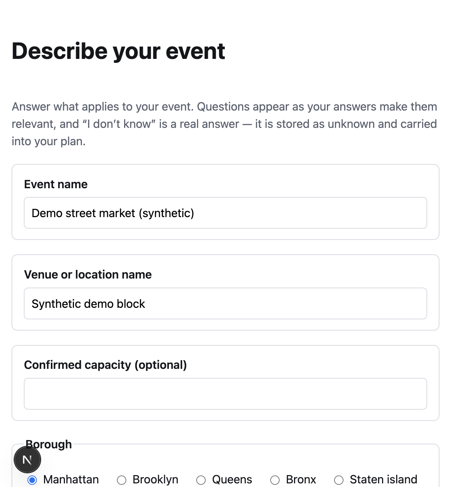
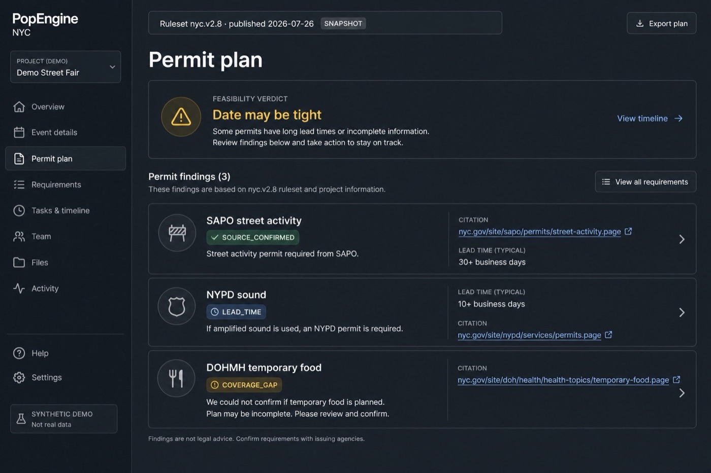
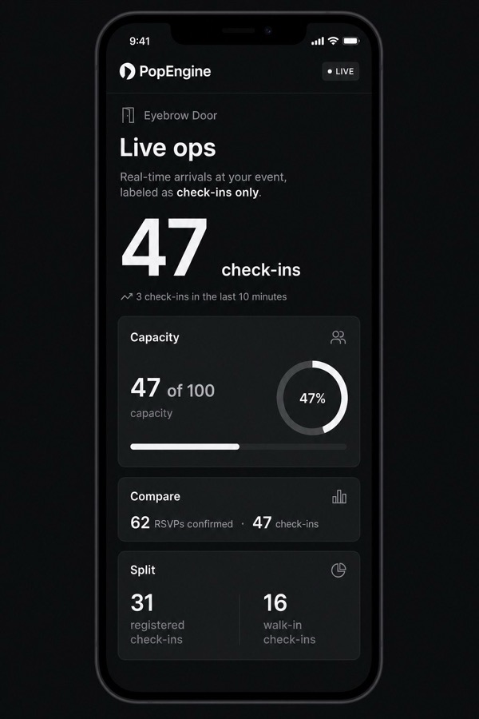

# PopEngine

NYC event permit planning for independent organizers — turn a short event description into a source-transparent permit plan, checklist, and (when built) door-day ops.

> Capstone demo environment is access-gated and uses **synthetic data only**. No real identity documents, applications, or attendee PII.

## Problem

Independent pop-up and event organizers in New York City must navigate a permit maze across many agencies (SAPO, Parks, NYPD, DOT, FDNY, DOB, Health, and others). Each agency has its own portal, lead time, fees, and documents. A single sidewalk activation with food and amplified sound can need several permits, with lead times from days to more than a year. Nothing tells an organizer which rules apply to *their* event or whether their date is still feasible — so people discover missing permits late, cancel, or get fined.

## Solution

PopEngine is a web app that answers a short intake (borough, location type, headcount, date, food, sound, structures, flame, alcohol, power) and generates a **complete, cited permit plan**: agencies, lead times, fees, documents, and a timeline computed backward from the event date, plus an immediate feasibility verdict.

Verification states stay visible end to end (`SOURCE_CONFIRMED`, `OFFICIAL_CONFLICT`, `RESEARCH_REQUIRED`, `COVERAGE_GAP`). The plan becomes a live compliance checklist with deadline alerts and portal links. Stretch Track B adds public event pages, RSVPs, QR check-in, and a live ops dashboard — arrivals labeled as **check-ins**, never occupancy.

```text
Intake → Feasibility verdict → Permit plan + citations
      → Checklist + alerts → (stretch) Promote / RSVP / Check-in / Live ops
```

## Tech stack

| Layer | Choice |
| --- | --- |
| Monorepo | pnpm workspaces |
| Web | Next.js (App Router), TypeScript |
| API | Express, TypeScript |
| Rules engine | `packages/engine` — pure TS (no DB, HTTP, env, or system clock) |
| Database | Postgres 16 (Supabase in demo) |
| Object storage | S3-compatible (Supabase Storage) for checklist documents |
| Email / SMS | Resend / Twilio (SMS may be labeled simulation until A2P clears) |
| Demo gate | Cloudflare Access (CORS is not auth) |
| Host | Railway |
| Tests | Vitest, coverage gate ≥ 90% |

Published regulatory facts come only from the ruleset discovered under `rules/` (never invent a permit name, deadline, or fee). Current versions: `docs/BASELINE.md`.

## Screenshots

Synthetic demo UI only — no real organizer or attendee data. Intake is a live capture of the local app; plan and live-ops frames are illustrative layout mocks for the README (runtime permit lines always come from the published ruleset, never from mock copy).



*Intake — short questionnaire that drives the rules engine.*



*Permit plan — findings, citations, and ruleset snapshot banner (illustrative).*



*Live ops (stretch) — check-in totals vs capacity; arrivals only, not occupancy (illustrative).*

## Setup

### Prerequisites

- **Node.js 22+**
- **pnpm** 11.5.x (see `packageManager` in root `package.json`)
- **Postgres 16** reachable locally (Homebrew, Docker, or a remote URL)

### Install

```bash
pnpm install
```

### Configure env

```bash
cp apps/api/.env.example apps/api/.env
cp apps/web/.env.example apps/web/.env.local
```

Minimum local values:

- `apps/api/.env` — set `DATABASE_URL` to your Postgres URL; leave `RULES_FILE` unset so the API discovers the published ruleset in `rules/`.
- `apps/web/.env.local` — `NEXT_PUBLIC_API_BASE_URL=http://localhost:3001` (default in the example).

Optional for full checklist uploads / alerts: fill S3 and Resend/Twilio keys from the examples. See `DEPLOY.md` for the gated demo stack.

### Migrate and run

Confirm Postgres answers a real query (not only `pg_isready`):

```bash
psql "$DATABASE_URL" -c 'select 1'
pnpm --filter api migrate up
```

Then in two terminals:

```bash
pnpm --filter api dev   # http://localhost:3001  — GET /health
pnpm --filter web dev   # http://localhost:3000
```

Open `http://localhost:3000/intake` to start.

### Quality gates

```bash
pnpm check:baseline   # APPROVED artifacts + no hardcoded ruleset paths
pnpm typecheck
pnpm lint
pnpm test             # Vitest across the workspace
pnpm test:coverage    # enforces the 90% gate
pnpm build            # Next.js production build
```

Set `DATABASE_URL` when running tests that hit Postgres (API integration suites skip without it).

## Repo map

- `apps/web` — organizer UI, plan/checklist, public event + check-in/live-ops surfaces
- `apps/api` — Express API, migrations, in-process alert poller
- `packages/engine` — pure rules evaluation
- `rules/` — published immutable NYC ruleset (one active file)
- `specs/` — feature specs (`F-*`)
- `docs/` — PRD, architecture, design, baseline, verification sources

## Docs to read before coding

1. `docs/BASELINE.md` — which artifact versions are current  
2. `AGENTS.md` + `CONTRIBUTING.md`  
3. Your `specs/F-xxx-*.md`  
4. Relevant sections of `docs/ARCHITECTURE.md`  
5. `rules/` + `docs/test-scenario-answer-key.md` when touching rules, plans, or verdicts  

## Deploy

See `DEPLOY.md` (Railway + Supabase + Resend + Twilio + Cloudflare Access). Demo is access-gated; synthetic data only (ARCHITECTURE AD-12).
