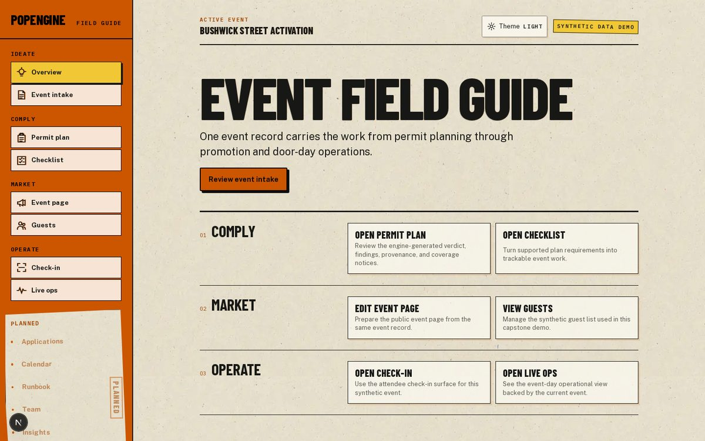
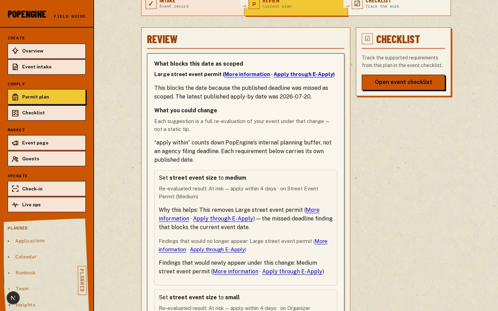
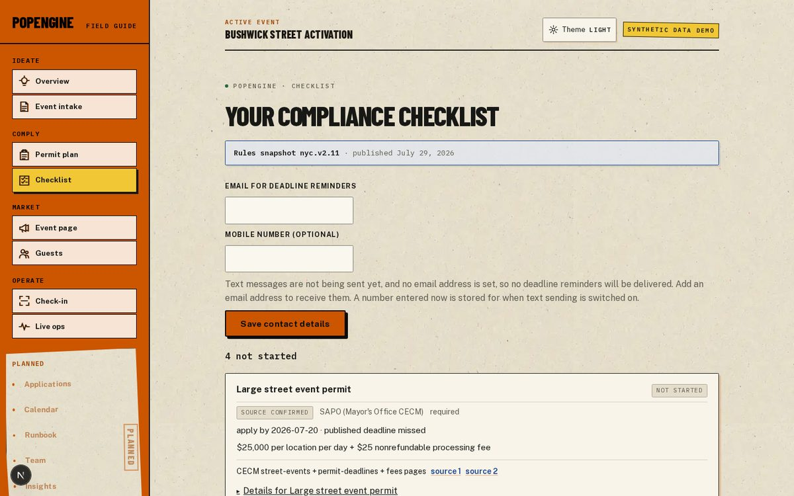
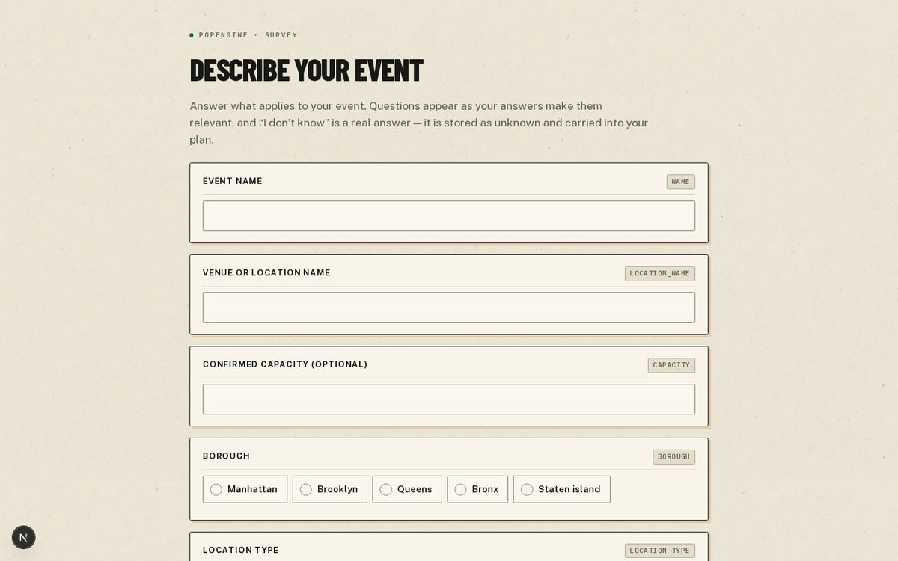

# PopEngine

**Tells a NYC event organizer whether their event can legally happen on the date they picked, and if it can't, the nearest version that can.**

[](https://github.com/jzeng151/pop-engine/actions/workflows/ci.yml)




> Capstone demo environment is access-gated and uses **synthetic data only**. No real identity documents, applications, or attendee PII.

---

## What it does

Independent organizers in New York City navigate permits across nine city and state agencies with filing deadlines from 14 to 60 days out, and festival classes that close December 31 of the _prior year_. Most find out too late. Today, avoiding that is sold as a professional service by event-production agencies.

PopEngine answers a short intake and returns a dated feasibility verdict. Here is real output from the demo scenario:

```
Bushwick Street Activation · multi-block street event · 35 days out

  ✗ INFEASIBLE as scoped
    Blocked by: Street Event Permit (Large)
    The published 45-day filing deadline passed on 2026-07-20.

  What you could change (each is a full re-evaluation, not a static tip)
    → street event size = medium      at risk, apply within 4 days
    → street event size = small       at risk, DOHMH notice in 4 days
    → location type = private venue   SAPO permit and insurance drop entirely;
                                      Place of Assembly approval appears instead
```

The list of permits is the easy half. **The deadline arithmetic, and knowing which smaller version of your event is still legal, is the part people pay for.**



Every line traces to a published rule with its source. When the ruleset does not cover a combination, the plan says so rather than guessing.



## What it does not do

Stated plainly, because a permit tool that overstates its coverage is worse than none.

- **New York City only.** One jurisdiction. 42 published rules and 4 advisories naming nine city and state agencies. A second city is designed for and not built.
- **Business-day deadlines render `NOT_CALCULABLE`.** No located primary source establishes that an agency's published closure stops its filing counter, and NYC rules span a city and a state agency whose calendars differ. Publishing a calendar anyway would invent the semantics, so the holiday calendar is deliberately empty.
- **It is not legal advice, and it never asserts a fact it cannot cite.** Where the record is silent, the output says the combination is not covered by this ruleset version.
- **Phase 2 is not shipped.** Authentication exists as a foundation; workspaces and roles gate production and are not built. The demo is single-tenant and synthetic.

## How it works

**The ruleset is a versioned file in git, not database rows.** A rule change is a pull request with a diff, a reviewer, and a checksum. `permit_rules` is a seeded read model, never the source. (`ARCHITECTURE.md` AD-2)

**The rules engine is a pure module** with no database, no HTTP, no environment, no system clock. `today` is a parameter. The six approved scenarios run as ordinary unit tests, and identical inputs always produce an identical plan. (AD-6)

**Plans are immutable snapshots** pinned to the ruleset version that produced them, so a plan from last week still reproduces after the rules change. (AD-7)

**Conditions are tri-state.** A material unknown never silently becomes false. It stays visible as `SOURCE_CONFIRMED`, `OFFICIAL_CONFLICT`, `RESEARCH_REQUIRED`, or `COVERAGE_GAP`, end to end from the rule to the screen.

```text
Intake → Feasibility verdict → Permit plan + citations → Checklist + deadline alerts
       → Public event page · RSVP · QR check-in · Live ops
```



## Quickstart

**Prerequisites:** Node.js 22+ · pnpm 11.5.3 (see `packageManager`) · Postgres 16

```bash
pnpm install
cp apps/api/.env.example apps/api/.env
cp apps/web/.env.example apps/web/.env.local
```

Set `DATABASE_URL` in `apps/api/.env`. Leave `RULES_FILE` unset so the API discovers the published ruleset under `rules/`. The web app defaults to `NEXT_PUBLIC_API_BASE_URL=http://localhost:3001`; leave the Supabase keys blank to run unauthenticated.

Confirm Postgres answers a real query, not only `pg_isready`:

```bash
psql "$DATABASE_URL" -c 'select 1'
pnpm --filter api migrate up
```

Then in two terminals:

```bash
pnpm --filter api dev   # http://localhost:3001, GET /health
pnpm --filter web dev   # http://localhost:3000
```

Open <http://localhost:3000/intake>.

### Quality gates

```bash
pnpm check:baseline   # approved artifacts agree with their own headers; no hardcoded ruleset paths
pnpm typecheck
pnpm lint
pnpm test:coverage    # enforces the 90% gate
pnpm build
```

`DATABASE_URL` must be set for the API integration suites; they skip without it.

## Repo map

| Path              | What lives there                                                             |
| ----------------- | ---------------------------------------------------------------------------- |
| `apps/web`        | organizer UI: intake, plan, checklist, public event page, check-in, live ops |
| `apps/api`        | Express API, migrations, in-process alert poller                             |
| `packages/engine` | pure rules evaluation with no DB, HTTP, env, or clock                        |
| `rules/`          | the published immutable NYC ruleset (exactly one active file)                |
| `specs/`          | approved feature specifications (`F-*`)                                      |
| `docs/`           | PRD, architecture, baseline manifest, verification sources, answer key       |
| `scripts/`        | governance guards wired into `pnpm check:baseline`                           |

## Contributing

Read **`AGENTS.md`** first. It lists which artifacts to read before touching code, in order, and when each applies. `CONTRIBUTING.md` carries the golden rules. `docs/DOCUMENTATION-GOVERNANCE.md` defines the authority hierarchy, the five document states, and which changes need which approvals.

The rule that matters most: **regulatory output comes only from the published ruleset. Never invent a permit name, agency, deadline, fee, or source.**

## Deploy

See **`DEPLOY.md`**: Railway (host) · Supabase (Postgres, storage, auth) · Resend (email) · Twilio (SMS) · Cloudflare Access (demo gate). The demo is access-gated with synthetic data only (`ARCHITECTURE.md` AD-12).

<details>
<summary><strong>Tech stack</strong></summary>

| Layer          | Choice                                                            |
| -------------- | ----------------------------------------------------------------- |
| Monorepo       | pnpm workspaces                                                   |
| Web            | Next.js (App Router), TypeScript                                  |
| API            | Express, TypeScript                                               |
| Rules engine   | `packages/engine`, pure TS                                        |
| Database       | Postgres 16 (Supabase in demo)                                    |
| Object storage | S3-compatible (Supabase Storage)                                  |
| Auth           | Supabase Auth (F-701 foundation; production gated on F-702/F-703) |
| Email / SMS    | Resend / Twilio (SMS is a labeled simulation until A2P clears)    |
| Demo gate      | Cloudflare Access (CORS is not auth)                              |
| Host           | Railway                                                           |
| Tests          | Vitest, 90% coverage gate                                         |

Current artifact versions are in `docs/BASELINE.md`.

</details>

## License

**Source code** is licensed under the [Apache License 2.0](LICENSE).

**The published ruleset (`rules/`), the verification record (`docs/VERIFICATION-SOURCES.md`), the scenario fixtures, and the product and architecture documents are not covered by it.** They are reserved pending a decision by the copyright holders. [`LICENSING.md`](LICENSING.md) says what falls where and why.

The ruleset is not legal advice. It records what named primary sources were observed to publish on recorded dates, and it is not a substitute for confirming a requirement with the issuing agency.
