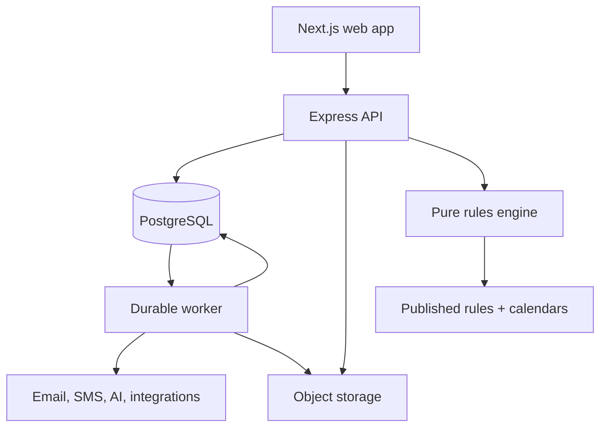

# PopEngine — Architecture Target (Phase 2+)

**Status:** APPROVED (2026-07-25; §7.1 renamed from "coverage status" to "result completeness" and its `CONDITIONAL` value replaced by `OPEN_FACTS_MAY_CHANGE_OUTCOME` 2026-07-26, resolving a three-way overload of "coverage" and a one-token-two-meanings collision with the shipped `Verdict`. That amendment carries TWO approvals, both given 2026-07-26 and recorded here because the approval class was itself questioned and resolved: the **product owner** approved the feature-meaning change, and because the amendment edits AD-07's row it is a **durable architecture decision** under `DOCUMENTATION-GOVERNANCE.md` §6, so it also carries an **Architecture ADR approval**, given by the product owner acting as architecture owner. §6's "shared enum" row was considered and does not apply, because §7.1's four values are implemented nowhere and nothing consumes them; PR #136 records that reasoning and the point at which it stops holding. §7.1's account of `COVERAGE_GAP` and its relation to the three scope axes is further amended 2026-07-27 under `DOCUMENTATION-GOVERNANCE.md` §2 against the published legend, and is approved under §6 ("Regulatory source/status/content") by the product owner acting as verification owner and rules reviewer. ONE person signed in THREE capacities, all lanes being currently held by one person. §6 states two things about that, and the first is unconditional: "No person approves their own regulatory publication alone. The author and source reviewer should be distinct whenever the team size permits." The first sentence does not bite here because there is no regulatory publication to approve: the amendment asserts no new regulatory fact, changes no rule, trigger, threshold, deadline or verification status, and conforms a lower-authority artifact to the legend already published in `rules/nyc-rules.v2.8.json` under §2's authority hierarchy. The second sentence is the one that applies, and its "whenever the team size permits" is what a single-person team cannot satisfy. Recorded so the sole-approver fact is visible rather than implied. Unlike the §7.1 rename above it carries NO Architecture ADR approval, and that is deliberate rather than an omission: it edits no AD row, so §6's durable-architecture-decision class is not reached. AD-15's consequence cell is further amended 2026-08-06 to state the product owner's approval as the whole requirement for a shared contract change, the coordinated review it required having been retired 2026-08-05; that amendment edits an AD row, so §6's durable-architecture-decision class IS reached and it is recorded as an approved ADR, AD-18 below. See `BASELINE.md`) — the destination architecture for Phases 2–4 and a planning target only. **This document is NOT the build instruction for Phase 0–1.5; `ARCHITECTURE.md` is.** Approval does not activate workers, tenancy, event revisions, OpenAPI contracts, or the AI gateway. Each requires its scheduled F-id, approved spec, and any named contract or ADR first.
**Event Revision reconciliation (2026-07-27):** §6.2 is aligned to PR #137's bounded contract under the one-time access-gated-demo overwrite recorded in `DOCUMENTATION-GOVERNANCE.md` §6. `@jzeng151` approved it as product and architecture owner; no other person's approval is implied. Production still requires strict ratification, which the product owner signs under governance §6.
**Origin:** delivered by an external documentation audit (2026-07-22, `docs/proposals/documentation-audit-2026-07-22.md`); section references to "the supplied rules file"/"v2 scenario suite" predate the corrected baseline and should be read as "the then-current draft."
**Companion authority:** Product scope lives in `PRD.md`; phase assignment in `ROADMAP.md`; approved feature behavior in `/specs`; regulatory facts in approved primary sources and published rulesets.

## 1. Architectural goals

PopEngine must:

1. Produce deterministic, source-traceable regulatory findings without using AI as a decision maker.
2. Say when it is conditional, incomplete, conflicted, or outside coverage; it must never label a partial plan complete.
3. Preserve exactly which event answers, rules, engine, and calendar produced every plan.
4. Allow the Event record to grow from planning through compliance, marketing, operations, and post-event intelligence without becoming one unmaintainable table.
5. Support four developers working in parallel through versioned contracts and bounded modules.
6. Start as a modular monolith and add operational components only when roadmap capabilities require them.
7. Protect documents, contact data, consent, and workspace data before real users are admitted.

## 2. Architecture decisions

| ID    | Decision                                                                                                                                                                                                                            | Consequence                                                                                                                                                                                                                                                                                                                                                                                                                                                                                                                                                                                                                                                                                                                                                                                                                                                                                                                                                                                                                                                                                                                                                                                                                                                                                                                                                                                                                                                                                                                                                                                                                                                                                                                                                                                                                                                                                                                                                                                                                                                                                                                                                                                                                                                                                                                                                                                                                                                                                                                                                                                                                                                                                                                                                                                                                                                                                                                                                                                                                                                                                                                                                                                                                                                                                                                                                                                                                                                                                                                                                                                                                                                                                                                                                                                                                                                                                                                                                                                                                                                                                                                                                                                                                                                                                                                                                                                                                                                                                                                                                                                                                                                                                                                                                                                                                                                                                                                                                                                                                                                                                                                                                                                                                                                                                                                                                                                                                                                                                                                                                                                                                                                                                                                                                                                                                                                                                                                                                                                                                                                                                                                                                                                                                                                                                                                                                                                                                                                     |
| ----- | ----------------------------------------------------------------------------------------------------------------------------------------------------------------------------------------------------------------------------------- | --------------------------------------------------------------------------------------------------------------------------------------------------------------------------------------------------------------------------------------------------------------------------------------------------------------------------------------------------------------------------------------------------------------------------------------------------------------------------------------------------------------------------------------------------------------------------------------------------------------------------------------------------------------------------------------------------------------------------------------------------------------------------------------------------------------------------------------------------------------------------------------------------------------------------------------------------------------------------------------------------------------------------------------------------------------------------------------------------------------------------------------------------------------------------------------------------------------------------------------------------------------------------------------------------------------------------------------------------------------------------------------------------------------------------------------------------------------------------------------------------------------------------------------------------------------------------------------------------------------------------------------------------------------------------------------------------------------------------------------------------------------------------------------------------------------------------------------------------------------------------------------------------------------------------------------------------------------------------------------------------------------------------------------------------------------------------------------------------------------------------------------------------------------------------------------------------------------------------------------------------------------------------------------------------------------------------------------------------------------------------------------------------------------------------------------------------------------------------------------------------------------------------------------------------------------------------------------------------------------------------------------------------------------------------------------------------------------------------------------------------------------------------------------------------------------------------------------------------------------------------------------------------------------------------------------------------------------------------------------------------------------------------------------------------------------------------------------------------------------------------------------------------------------------------------------------------------------------------------------------------------------------------------------------------------------------------------------------------------------------------------------------------------------------------------------------------------------------------------------------------------------------------------------------------------------------------------------------------------------------------------------------------------------------------------------------------------------------------------------------------------------------------------------------------------------------------------------------------------------------------------------------------------------------------------------------------------------------------------------------------------------------------------------------------------------------------------------------------------------------------------------------------------------------------------------------------------------------------------------------------------------------------------------------------------------------------------------------------------------------------------------------------------------------------------------------------------------------------------------------------------------------------------------------------------------------------------------------------------------------------------------------------------------------------------------------------------------------------------------------------------------------------------------------------------------------------------------------------------------------------------------------------------------------------------------------------------------------------------------------------------------------------------------------------------------------------------------------------------------------------------------------------------------------------------------------------------------------------------------------------------------------------------------------------------------------------------------------------------------------------------------------------------------------------------------------------------------------------------------------------------------------------------------------------------------------------------------------------------------------------------------------------------------------------------------------------------------------------------------------------------------------------------------------------------------------------------------------------------------------------------------------------------------------------------------------------------------------------------------------------------------------------------------------------------------------------------------------------------------------------------------------------------------------------------------------------------------------------------------------------------------------------------------------------------------------------------------------------------------------------------------------------------------------------------------------------------------- |
| AD-01 | Use a TypeScript monorepo with a Next.js web app, Express API, and a worker process.                                                                                                                                                | Web, API, worker, and pure packages share versioned contracts but deploy independently. Exact Node, pnpm, Next.js, and TypeScript versions are pinned in-repo.                                                                                                                                                                                                                                                                                                                                                                                                                                                                                                                                                                                                                                                                                                                                                                                                                                                                                                                                                                                                                                                                                                                                                                                                                                                                                                                                                                                                                                                                                                                                                                                                                                                                                                                                                                                                                                                                                                                                                                                                                                                                                                                                                                                                                                                                                                                                                                                                                                                                                                                                                                                                                                                                                                                                                                                                                                                                                                                                                                                                                                                                                                                                                                                                                                                                                                                                                                                                                                                                                                                                                                                                                                                                                                                                                                                                                                                                                                                                                                                                                                                                                                                                                                                                                                                                                                                                                                                                                                                                                                                                                                                                                                                                                                                                                                                                                                                                                                                                                                                                                                                                                                                                                                                                                                                                                                                                                                                                                                                                                                                                                                                                                                                                                                                                                                                                                                                                                                                                                                                                                                                                                                                                                                                                                                                                                                  |
| AD-02 | Build a modular monolith, not microservices.                                                                                                                                                                                        | Domain modules have explicit APIs and table ownership, but one repository and one PostgreSQL database. Extract a service only after measured operational need.                                                                                                                                                                                                                                                                                                                                                                                                                                                                                                                                                                                                                                                                                                                                                                                                                                                                                                                                                                                                                                                                                                                                                                                                                                                                                                                                                                                                                                                                                                                                                                                                                                                                                                                                                                                                                                                                                                                                                                                                                                                                                                                                                                                                                                                                                                                                                                                                                                                                                                                                                                                                                                                                                                                                                                                                                                                                                                                                                                                                                                                                                                                                                                                                                                                                                                                                                                                                                                                                                                                                                                                                                                                                                                                                                                                                                                                                                                                                                                                                                                                                                                                                                                                                                                                                                                                                                                                                                                                                                                                                                                                                                                                                                                                                                                                                                                                                                                                                                                                                                                                                                                                                                                                                                                                                                                                                                                                                                                                                                                                                                                                                                                                                                                                                                                                                                                                                                                                                                                                                                                                                                                                                                                                                                                                                                                  |
| AD-03 | Keep the rules engine pure: no database, HTTP, environment reads, random values, or system clock.                                                                                                                                   | Evaluation receives event revision, ruleset, `today`, timezone, engine version, and calendar data as explicit inputs.                                                                                                                                                                                                                                                                                                                                                                                                                                                                                                                                                                                                                                                                                                                                                                                                                                                                                                                                                                                                                                                                                                                                                                                                                                                                                                                                                                                                                                                                                                                                                                                                                                                                                                                                                                                                                                                                                                                                                                                                                                                                                                                                                                                                                                                                                                                                                                                                                                                                                                                                                                                                                                                                                                                                                                                                                                                                                                                                                                                                                                                                                                                                                                                                                                                                                                                                                                                                                                                                                                                                                                                                                                                                                                                                                                                                                                                                                                                                                                                                                                                                                                                                                                                                                                                                                                                                                                                                                                                                                                                                                                                                                                                                                                                                                                                                                                                                                                                                                                                                                                                                                                                                                                                                                                                                                                                                                                                                                                                                                                                                                                                                                                                                                                                                                                                                                                                                                                                                                                                                                                                                                                                                                                                                                                                                                                                                           |
| AD-04 | Treat published rulesets as immutable artifacts.                                                                                                                                                                                    | Git is the publication workflow through Phase 3. The rules admin system in Phase 4 publishes the same immutable artifact format; it does not create a second runtime truth.                                                                                                                                                                                                                                                                                                                                                                                                                                                                                                                                                                                                                                                                                                                                                                                                                                                                                                                                                                                                                                                                                                                                                                                                                                                                                                                                                                                                                                                                                                                                                                                                                                                                                                                                                                                                                                                                                                                                                                                                                                                                                                                                                                                                                                                                                                                                                                                                                                                                                                                                                                                                                                                                                                                                                                                                                                                                                                                                                                                                                                                                                                                                                                                                                                                                                                                                                                                                                                                                                                                                                                                                                                                                                                                                                                                                                                                                                                                                                                                                                                                                                                                                                                                                                                                                                                                                                                                                                                                                                                                                                                                                                                                                                                                                                                                                                                                                                                                                                                                                                                                                                                                                                                                                                                                                                                                                                                                                                                                                                                                                                                                                                                                                                                                                                                                                                                                                                                                                                                                                                                                                                                                                                                                                                                                                                     |
| AD-05 | Separate stable Event identity from immutable Event Revisions.                                                                                                                                                                      | Editing intake answers creates a new revision. A plan always references one exact revision; staleness is computed server-side.                                                                                                                                                                                                                                                                                                                                                                                                                                                                                                                                                                                                                                                                                                                                                                                                                                                                                                                                                                                                                                                                                                                                                                                                                                                                                                                                                                                                                                                                                                                                                                                                                                                                                                                                                                                                                                                                                                                                                                                                                                                                                                                                                                                                                                                                                                                                                                                                                                                                                                                                                                                                                                                                                                                                                                                                                                                                                                                                                                                                                                                                                                                                                                                                                                                                                                                                                                                                                                                                                                                                                                                                                                                                                                                                                                                                                                                                                                                                                                                                                                                                                                                                                                                                                                                                                                                                                                                                                                                                                                                                                                                                                                                                                                                                                                                                                                                                                                                                                                                                                                                                                                                                                                                                                                                                                                                                                                                                                                                                                                                                                                                                                                                                                                                                                                                                                                                                                                                                                                                                                                                                                                                                                                                                                                                                                                                                  |
| AD-06 | Treat plans as immutable evaluations and findings as immutable snapshots.                                                                                                                                                           | Regeneration creates a new plan, preserves the old plan, and produces a diff. Active workflow data is never silently rewritten.                                                                                                                                                                                                                                                                                                                                                                                                                                                                                                                                                                                                                                                                                                                                                                                                                                                                                                                                                                                                                                                                                                                                                                                                                                                                                                                                                                                                                                                                                                                                                                                                                                                                                                                                                                                                                                                                                                                                                                                                                                                                                                                                                                                                                                                                                                                                                                                                                                                                                                                                                                                                                                                                                                                                                                                                                                                                                                                                                                                                                                                                                                                                                                                                                                                                                                                                                                                                                                                                                                                                                                                                                                                                                                                                                                                                                                                                                                                                                                                                                                                                                                                                                                                                                                                                                                                                                                                                                                                                                                                                                                                                                                                                                                                                                                                                                                                                                                                                                                                                                                                                                                                                                                                                                                                                                                                                                                                                                                                                                                                                                                                                                                                                                                                                                                                                                                                                                                                                                                                                                                                                                                                                                                                                                                                                                                                                 |
| AD-07 | Use a layered status model.                                                                                                                                                                                                         | After its consuming migration, result completeness (§7.1), finding type, deadline status, and workflow status are separate fields and the flat verdict is retired. The Phase 0–1.5 four-state verdict remains authoritative until then.                                                                                                                                                                                                                                                                                                                                                                                                                                                                                                                                                                                                                                                                                                                                                                                                                                                                                                                                                                                                                                                                                                                                                                                                                                                                                                                                                                                                                                                                                                                                                                                                                                                                                                                                                                                                                                                                                                                                                                                                                                                                                                                                                                                                                                                                                                                                                                                                                                                                                                                                                                                                                                                                                                                                                                                                                                                                                                                                                                                                                                                                                                                                                                                                                                                                                                                                                                                                                                                                                                                                                                                                                                                                                                                                                                                                                                                                                                                                                                                                                                                                                                                                                                                                                                                                                                                                                                                                                                                                                                                                                                                                                                                                                                                                                                                                                                                                                                                                                                                                                                                                                                                                                                                                                                                                                                                                                                                                                                                                                                                                                                                                                                                                                                                                                                                                                                                                                                                                                                                                                                                                                                                                                                                                                         |
| AD-08 | Represent conditions and calculations with validated typed data.                                                                                                                                                                    | No `eval`, dynamic code, natural-language formulas, or jurisdiction-specific executable extensions. Rules use approved condition and calculation AST primitives; a missing primitive requires a separate reviewed schema/engine change.                                                                                                                                                                                                                                                                                                                                                                                                                                                                                                                                                                                                                                                                                                                                                                                                                                                                                                                                                                                                                                                                                                                                                                                                                                                                                                                                                                                                                                                                                                                                                                                                                                                                                                                                                                                                                                                                                                                                                                                                                                                                                                                                                                                                                                                                                                                                                                                                                                                                                                                                                                                                                                                                                                                                                                                                                                                                                                                                                                                                                                                                                                                                                                                                                                                                                                                                                                                                                                                                                                                                                                                                                                                                                                                                                                                                                                                                                                                                                                                                                                                                                                                                                                                                                                                                                                                                                                                                                                                                                                                                                                                                                                                                                                                                                                                                                                                                                                                                                                                                                                                                                                                                                                                                                                                                                                                                                                                                                                                                                                                                                                                                                                                                                                                                                                                                                                                                                                                                                                                                                                                                                                                                                                                                                         |
| AD-09 | Use PostgreSQL as the system of record and S3-compatible object storage for file bytes.                                                                                                                                             | File metadata and authorization stay in PostgreSQL; downloads use short-lived signed URLs.                                                                                                                                                                                                                                                                                                                                                                                                                                                                                                                                                                                                                                                                                                                                                                                                                                                                                                                                                                                                                                                                                                                                                                                                                                                                                                                                                                                                                                                                                                                                                                                                                                                                                                                                                                                                                                                                                                                                                                                                                                                                                                                                                                                                                                                                                                                                                                                                                                                                                                                                                                                                                                                                                                                                                                                                                                                                                                                                                                                                                                                                                                                                                                                                                                                                                                                                                                                                                                                                                                                                                                                                                                                                                                                                                                                                                                                                                                                                                                                                                                                                                                                                                                                                                                                                                                                                                                                                                                                                                                                                                                                                                                                                                                                                                                                                                                                                                                                                                                                                                                                                                                                                                                                                                                                                                                                                                                                                                                                                                                                                                                                                                                                                                                                                                                                                                                                                                                                                                                                                                                                                                                                                                                                                                                                                                                                                                                      |
| AD-10 | Use a durable PostgreSQL-backed jobs/outbox model.                                                                                                                                                                                  | Phase 1 alerts may share the API deployment, but job claiming and delivery are durable. Phase 2 runs the same code as a separate worker. Redis is not required.                                                                                                                                                                                                                                                                                                                                                                                                                                                                                                                                                                                                                                                                                                                                                                                                                                                                                                                                                                                                                                                                                                                                                                                                                                                                                                                                                                                                                                                                                                                                                                                                                                                                                                                                                                                                                                                                                                                                                                                                                                                                                                                                                                                                                                                                                                                                                                                                                                                                                                                                                                                                                                                                                                                                                                                                                                                                                                                                                                                                                                                                                                                                                                                                                                                                                                                                                                                                                                                                                                                                                                                                                                                                                                                                                                                                                                                                                                                                                                                                                                                                                                                                                                                                                                                                                                                                                                                                                                                                                                                                                                                                                                                                                                                                                                                                                                                                                                                                                                                                                                                                                                                                                                                                                                                                                                                                                                                                                                                                                                                                                                                                                                                                                                                                                                                                                                                                                                                                                                                                                                                                                                                                                                                                                                                                                                 |
| AD-11 | Introduce authentication before any real-user beta.                                                                                                                                                                                 | A no-account capstone demo is permitted only behind an environment access gate with synthetic data. CORS is never treated as authorization.                                                                                                                                                                                                                                                                                                                                                                                                                                                                                                                                                                                                                                                                                                                                                                                                                                                                                                                                                                                                                                                                                                                                                                                                                                                                                                                                                                                                                                                                                                                                                                                                                                                                                                                                                                                                                                                                                                                                                                                                                                                                                                                                                                                                                                                                                                                                                                                                                                                                                                                                                                                                                                                                                                                                                                                                                                                                                                                                                                                                                                                                                                                                                                                                                                                                                                                                                                                                                                                                                                                                                                                                                                                                                                                                                                                                                                                                                                                                                                                                                                                                                                                                                                                                                                                                                                                                                                                                                                                                                                                                                                                                                                                                                                                                                                                                                                                                                                                                                                                                                                                                                                                                                                                                                                                                                                                                                                                                                                                                                                                                                                                                                                                                                                                                                                                                                                                                                                                                                                                                                                                                                                                                                                                                                                                                                                                     |
| AD-12 | Make workspace tenancy the authorization boundary.                                                                                                                                                                                  | Once F-701/F-702/F-703 ship, every user-owned aggregate carries `workspace_id`; membership and role authorization are enforced server-side in one policy layer.                                                                                                                                                                                                                                                                                                                                                                                                                                                                                                                                                                                                                                                                                                                                                                                                                                                                                                                                                                                                                                                                                                                                                                                                                                                                                                                                                                                                                                                                                                                                                                                                                                                                                                                                                                                                                                                                                                                                                                                                                                                                                                                                                                                                                                                                                                                                                                                                                                                                                                                                                                                                                                                                                                                                                                                                                                                                                                                                                                                                                                                                                                                                                                                                                                                                                                                                                                                                                                                                                                                                                                                                                                                                                                                                                                                                                                                                                                                                                                                                                                                                                                                                                                                                                                                                                                                                                                                                                                                                                                                                                                                                                                                                                                                                                                                                                                                                                                                                                                                                                                                                                                                                                                                                                                                                                                                                                                                                                                                                                                                                                                                                                                                                                                                                                                                                                                                                                                                                                                                                                                                                                                                                                                                                                                                                                                 |
| AD-13 | Put every external service behind an adapter.                                                                                                                                                                                       | Email, SMS, storage, geocoding, AI, ticketing, calendar, and POS providers cannot leak provider-specific shapes into domain code.                                                                                                                                                                                                                                                                                                                                                                                                                                                                                                                                                                                                                                                                                                                                                                                                                                                                                                                                                                                                                                                                                                                                                                                                                                                                                                                                                                                                                                                                                                                                                                                                                                                                                                                                                                                                                                                                                                                                                                                                                                                                                                                                                                                                                                                                                                                                                                                                                                                                                                                                                                                                                                                                                                                                                                                                                                                                                                                                                                                                                                                                                                                                                                                                                                                                                                                                                                                                                                                                                                                                                                                                                                                                                                                                                                                                                                                                                                                                                                                                                                                                                                                                                                                                                                                                                                                                                                                                                                                                                                                                                                                                                                                                                                                                                                                                                                                                                                                                                                                                                                                                                                                                                                                                                                                                                                                                                                                                                                                                                                                                                                                                                                                                                                                                                                                                                                                                                                                                                                                                                                                                                                                                                                                                                                                                                                                               |
| AD-14 | Route all AI work through an AI gateway with proposal semantics.                                                                                                                                                                    | AI may draft or extract. Material extracted values require confirmation; AI cannot publish a rule or authoritatively determine a permit.                                                                                                                                                                                                                                                                                                                                                                                                                                                                                                                                                                                                                                                                                                                                                                                                                                                                                                                                                                                                                                                                                                                                                                                                                                                                                                                                                                                                                                                                                                                                                                                                                                                                                                                                                                                                                                                                                                                                                                                                                                                                                                                                                                                                                                                                                                                                                                                                                                                                                                                                                                                                                                                                                                                                                                                                                                                                                                                                                                                                                                                                                                                                                                                                                                                                                                                                                                                                                                                                                                                                                                                                                                                                                                                                                                                                                                                                                                                                                                                                                                                                                                                                                                                                                                                                                                                                                                                                                                                                                                                                                                                                                                                                                                                                                                                                                                                                                                                                                                                                                                                                                                                                                                                                                                                                                                                                                                                                                                                                                                                                                                                                                                                                                                                                                                                                                                                                                                                                                                                                                                                                                                                                                                                                                                                                                                                        |
| AD-15 | Make OpenAPI, JSON Schema, migrations, and executable fixtures first-class contracts.                                                                                                                                               | Prose explains behavior; machines enforce the contract. A shared contract change carries the product owner's approval, including one they authored, and a feature branch may consume it on that approval alone (coordinated review retired 2026-08-05; see the note below this table).                                                                                                                                                                                                                                                                                                                                                                                                                                                                                                                                                                                                                                                                                                                                                                                                                                                                                                                                                                                                                                                                                                                                                                                                                                                                                                                                                                                                                                                                                                                                                                                                                                                                                                                                                                                                                                                                                                                                                                                                                                                                                                                                                                                                                                                                                                                                                                                                                                                                                                                                                                                                                                                                                                                                                                                                                                                                                                                                                                                                                                                                                                                                                                                                                                                                                                                                                                                                                                                                                                                                                                                                                                                                                                                                                                                                                                                                                                                                                                                                                                                                                                                                                                                                                                                                                                                                                                                                                                                                                                                                                                                                                                                                                                                                                                                                                                                                                                                                                                                                                                                                                                                                                                                                                                                                                                                                                                                                                                                                                                                                                                                                                                                                                                                                                                                                                                                                                                                                                                                                                                                                                                                                                                          |
| AD-16 | Use Supabase Auth as F-701's single identity and session provider, with email/password and Google OAuth as its two authentication methods.                                                                                          | Next.js uses Supabase's App Router SSR/PKCE cookie flow; protected Express routes verify Supabase bearer claims through the provider-supported verifier. No custom credential/session store or workspace/role authorization is implied.                                                                                                                                                                                                                                                                                                                                                                                                                                                                                                                                                                                                                                                                                                                                                                                                                                                                                                                                                                                                                                                                                                                                                                                                                                                                                                                                                                                                                                                                                                                                                                                                                                                                                                                                                                                                                                                                                                                                                                                                                                                                                                                                                                                                                                                                                                                                                                                                                                                                                                                                                                                                                                                                                                                                                                                                                                                                                                                                                                                                                                                                                                                                                                                                                                                                                                                                                                                                                                                                                                                                                                                                                                                                                                                                                                                                                                                                                                                                                                                                                                                                                                                                                                                                                                                                                                                                                                                                                                                                                                                                                                                                                                                                                                                                                                                                                                                                                                                                                                                                                                                                                                                                                                                                                                                                                                                                                                                                                                                                                                                                                                                                                                                                                                                                                                                                                                                                                                                                                                                                                                                                                                                                                                                                                         |
| AD-17 | `docs/DESIGN.md`'s dependency-graph row relating F-601 and F-109 is a consequence note, not a build-order constraint.                                                                                                               | The row records that adding F-601 is what makes F-109 necessary and states no order between them. Build order comes from the two features' own approval blockers, which this decision does not touch, so reading the graph literally no longer implies an order those blockers contradict.                                                                                                                                                                                                                                                                                                                                                                                                                                                                                                                                                                                                                                                                                                                                                                                                                                                                                                                                                                                                                                                                                                                                                                                                                                                                                                                                                                                                                                                                                                                                                                                                                                                                                                                                                                                                                                                                                                                                                                                                                                                                                                                                                                                                                                                                                                                                                                                                                                                                                                                                                                                                                                                                                                                                                                                                                                                                                                                                                                                                                                                                                                                                                                                                                                                                                                                                                                                                                                                                                                                                                                                                                                                                                                                                                                                                                                                                                                                                                                                                                                                                                                                                                                                                                                                                                                                                                                                                                                                                                                                                                                                                                                                                                                                                                                                                                                                                                                                                                                                                                                                                                                                                                                                                                                                                                                                                                                                                                                                                                                                                                                                                                                                                                                                                                                                                                                                                                                                                                                                                                                                                                                                                                                      |
| AD-18 | A shared contract change carries the product owner's approval alone, the second party AD-15 asked for having been retired 2026-08-05.                                                                                               | AD-15's consequence cell states that approval as the whole requirement for all four contract kinds it names, and a feature branch consumes the change on it. A fixture or expected output is still a regulatory publication, so which §6 row its approval comes from is unchanged.                                                                                                                                                                                                                                                                                                                                                                                                                                                                                                                                                                                                                                                                                                                                                                                                                                                                                                                                                                                                                                                                                                                                                                                                                                                                                                                                                                                                                                                                                                                                                                                                                                                                                                                                                                                                                                                                                                                                                                                                                                                                                                                                                                                                                                                                                                                                                                                                                                                                                                                                                                                                                                                                                                                                                                                                                                                                                                                                                                                                                                                                                                                                                                                                                                                                                                                                                                                                                                                                                                                                                                                                                                                                                                                                                                                                                                                                                                                                                                                                                                                                                                                                                                                                                                                                                                                                                                                                                                                                                                                                                                                                                                                                                                                                                                                                                                                                                                                                                                                                                                                                                                                                                                                                                                                                                                                                                                                                                                                                                                                                                                                                                                                                                                                                                                                                                                                                                                                                                                                                                                                                                                                                                                              |
| AD-19 | A `dedupe_key` group's members are alternative published routes to one requirement, and `mergeGroup()` in `packages/engine/src/findings.ts` merges it per field on that reading, standing in for §8.4's unwritten precedence table. | `disposition` is the strongest disposition any route contributes, capped at `may_be_required` for a route whose own trigger is unknown, and only where the group holds a resolved route at or above that ceiling for the cap to stop it being promoted past; ONE BINDING ROUTE SUPPLIES BOTH IDENTITY AND TIMELINE (**amended 2026-08-08, product owner; the identity/timeline split this row carried until then is replaced, see the approval below**), so the merged line never names route A and dates route B; the binding route is chosen from the routes contributing the merged disposition, narrowed to the resolved routes among them where any resolved route contributes it, by the window availability order below; every OTHER route keeps its own `ruleId`, trigger result, unresolved fields, name, agency, disposition, deadline, window, status, slack, fee and portal as an entry in the finding's `routes` list, and `computeWindowVerdict()` reads those entries rather than the merged line, which is what makes the replaced split's reason (a published window must never be dropped for sitting in a weaker disposition tier) unnecessary: the window is on its route whether or not that route won the line; `headlineMode` is `applies_together` where every contributing trigger resolved and `candidate` otherwise, computed as `resolved.length === routes.length`, with the mixed case answered per route rather than by a third mode value; window availability ranks over four levels, a dated window still open, then one that has closed, then one the engine could not date, then no published window at all, with the earlier date and then the lower rule id breaking ties; retained rule ids, notes, sources, trigger reasons and summary points concatenate in contributing order; and the four single-valued published texts, including the plain-language heading, fall back through the remaining routes in binding order so no published text is dropped or decided by file position. Where §8.4's blocking-finding guarantee collides with its no-promotion guarantee, meaning a blocking route whose own trigger resolved `unknown` sharing a key with a resolved permit route, the no-promotion one wins and the headline disposition is the permit's; the blocking route survives everywhere else and the plan stays CONDITIONAL (§8.4). It publishes no ruleset. **It moved no output on `nyc.v2.11` when it was recorded, and that is no longer true:** the supersession named below is implemented in `packages/engine/src/findings.ts` on the branch of PR #252, and it moves organizer-facing output on the published ruleset. **The 64 of 3,200 that `docs/proposals/dedupe-route-list.md` §9.1 used to record is WITHDRAWN, and so is the field set it claimed.** It was measured over an unrecorded base intake by a harness that was never committed, neither committed harness reproduces it, and it said the deadline, apply-by date, status, slack, fee and summary heading moved as well as the name. That is the same shape of claim as the 224 of 1,600 this record already corrected, and it is withdrawn on the same ground rather than reported beside a reproducible figure as though the two were alternatives. §9.1 now records what `scripts/dedupe-route-sweep.mts` produces from this tree: **56 of 3,200**, on both a published and an unpublished holiday list. **0 verdicts differ on either.** Every affected plan has `structure_over_10ft_tall: "yes"` with DOB-TENT-001's trigger unresolved, and on them the merged line's NAME moves from the tent route to the tall-structure route; after PR #252 the filing date, status, fee and reminders on those plans are identical to `main`, read off the tent route and attributed to it. A third figure is measured through the api rather than the engine, because the checklist reads a column rather than a finding: a merged line whose binding route publishes no window leaves `permit_plan_items.latest_apply_date` null while the row renders that route's date, and ordering plan items on the column alone reorders **42 of the 3,200 intakes** of `scripts/checklist-order-sweep.mts` under a published holiday list, and **0** under the deployed `holidays: null`, against `main`; `materialize` then froze that order into `cohort_position`. Ordering on the date the row shows returns both figures to **0**. **An earlier draft of this row carried 224 of 1,600 and it was wrong in both numbers.** It was measured by a harness that was never committed and could not be re-derived, which is the shape of claim this PR series exists to remove, so the harness that produces the corrected figure ships with it and every figure this row states is now reproducible from this tree. The numbers are recorded here so a reader of this register finds them without reading a proposal. Publishing the real table supersedes this row (`docs/OPEN-QUESTIONS.md` T-12). **AMENDED 2026-08-08 (product owner, PR #252, `docs/proposals/dedupe-route-list.md`, recorded in `docs/BASELINE.md`).** The product owner approved that proposal on 2026-08-08, on all four governance §6 rows it matches, and this row is amended to state the approved rule rather than to describe a challenge to an unapproved one. Exactly one sentence of this row was replaced, the identity/timeline split, and the replacement is stated above rather than left to be inferred from a proposal; everything else in this row survives unchanged, including the strongest-contributing-disposition rule, the unresolved-route ceiling and its carve-out, the four-level window availability order, the earlier-date and lower-rule-id tie-breaks, the contributing-order concatenation of the retained lists, `lastVerifiedDate` as the earliest across the group, the single-valued-text fallback and the §8.4 collision rule. **The approval is dated after the engine implemented it, and that is on the record rather than smoothed over:** `packages/engine/src/findings.ts` carried the route list while this document still said the rule was unapproved, which is a §5 divergence between the engine and its authoritative register. `SPEC-CONFLICT` #253 was opened for it and closed by this approval, so the record shows the route governance prescribes rather than an implementation that quietly became the rule. |

AD-16 was approved 2026-07-28 by the product owner/user acting as architecture owner through the
PR #201 follow-up. This records one person's approval in both capacities, not independent reviews.

AD-17 was approved 2026-08-05 by the product owner, amending `docs/DESIGN.md`'s "Dependency Graph
(build-order constraints)" row for F-601 and F-109 and closing `docs/OPEN-QUESTIONS.md` T-8.
`DOCUMENTATION-GOVERNANCE.md` §1 gives `DESIGN.md` the sequence concern, so the amendment lands
there rather than in either feature's proposal, and §6 routes it to this register as a durable
architecture decision recorded as an approved ADR. One person signed it in the one capacity §6 now
names; no second signatory exists, and none is claimed. It asserts no regulatory fact. What it does
is label the row: it decides which of the two readings that row carries, and it decides no build
order. F-601's and F-109's approval blockers are unchanged, and the sequence they require is
untouched by it.

AD-18 was approved 2026-08-06 by the product owner, amending AD-15's consequence cell in the table
above. Line 3 states this document's own rule for that case: an amendment that edits an AD row is a
durable architecture decision under `DOCUMENTATION-GOVERNANCE.md` §6, so it carries an Architecture
ADR approval, which §6 requires be recorded as an approved ADR. That is what this row is. The
2026-07-26 amendment of AD-07's row carries the same Architecture ADR approval, recorded in line 3's
Status header rather than as a register row. One person signed it in the one
capacity §6 now names; no second signatory exists, and none is claimed. It asserts no regulatory
fact and publishes no ruleset. The retirement AD-18 applies is not its own: that is the product
owner's 2026-08-05 decision recorded in `DOCUMENTATION-GOVERNANCE.md` §6 and `BASELINE.md`. What
AD-18 decides is that AD-15's row states the retirement rather than continuing to instruct a review
the record retired. The earlier reasoning that left the row as written, that the coordinated review
was UNMET rather than retired for the three contract kinds that assert no regulatory fact, does not
survive and is superseded here: the retired class is defined by the shape of the requirement, some
other party reviewing, not by whether the artifact it guards is regulatory, and `BASELINE.md`
records AD-15's coordinated review as retired for all four contract kinds. A row that still required
the review would have been a live instruction contradicting the record that retired it, which is the
failure the retirement names as its own reason.

AD-19 was approved 2026-08-05 by the product owner, recorded here as the approved ADR §6 requires,
and amends §8.4 of this document. AD-17 established the routing: a decision that only labels which
of two readings a `DESIGN.md` row carries is still a durable architecture decision recorded as an
approved ADR, so a decision that amends this document, changes engine precedence and stands in for a
table §8.4 assigns to the rules schema/engine spec is reached by the same row, and a `BASELINE.md`
paragraph plus a §8.4 note is not the record that row asks for. §6 carries a second row this change
matches by name, "Rule trigger, dedupe, branch, deadline, or formula semantics", and it is addressed
rather than left unmentioned: it requires the same capacity, the product owner, so naming it changes
who signs nothing. One person signed in that one capacity; no second signatory exists and none is
claimed or implied.

Whether this is a regulatory publication is the question those two rows raise, and the answer
recorded here is no. This is not a regulatory publication: no ruleset is published, no rule, trigger, deadline, fee,
agency, threshold, portal, exception or verification status changes, every value the merged line
renders is some contributing rule's own published value, and every contributing route stays in
`ruleIds` and `sources`. That rests on §6's own text and on nothing else: two earlier corroborations
were cited here, `specs/F-103-scope-comparator.md`'s line for issue #239 and `OPEN-QUESTIONS.md` T-4,
and both are removed rather than left standing, because neither is authority. F-103 is `PROPOSED` and
not implementable (`docs/BASELINE.md`), and §1 says `OPEN-QUESTIONS.md` is never authority for
implementation; F-103 also names two routes to close #239, a load-time guard and per-contributing-rule
`disposition` and `verificationStatus` on `FindingSource`, and this change implements neither, so its
line was drawn about a different change. The evidence is that output does not move: over a sweep of
288 structure intakes under both the deployed `holidays: null` configuration and a published holiday
list, plans on `nyc.v2.11` are byte-identical to the merge this replaces. What changes is that every
value the merge decides no longer depends on file order; the retained lists still concatenate in
contributing order, so a plan is not order-independent end to end.

The second-party review requirement was **retired by the product owner on 2026-08-05**, recorded in
`docs/BASELINE.md` and in `docs/DOCUMENTATION-GOVERNANCE.md` §6, which no longer carries the closing
paragraph that required a second signatory for a regulatory publication. So no second signatory is
owed on AD-19 whichever way the classification above lands, and none is claimed. The branch carrying
this record is rebased on the change that retires the requirement, which is PR #248, so **this change
must not merge before it**.

`AGENTS.md`'s regulatory-safety section says rule-semantics changes are regulatory publication and
that the product owner's approval is the whole requirement for them. Whether that sentence reaches
this engine-only merge, or only a change to what the published ruleset says or what the loader will
accept, which is F-103's Route 1, it routes to the same approver either way, so the reading is
recorded rather than argued: AD-19 is signed by the product owner in that capacity.

AD-15's "coordinated review before feature branches consume them" asked for a second party to look
at a shared contract change. That requirement is RETIRED as of 2026-08-05 (product owner; see
`DOCUMENTATION-GOVERNANCE.md` §6 and `BASELINE.md`), for all four kinds of contract AD-15 names and
without the split the earlier record drew between them. Executable fixtures and expected outputs are
still regulatory publication, `DOCUMENTATION-GOVERNANCE.md` §2 level 3 and §1's authoritative
artifact for an executable regulatory expectation, and changing one is still the product owner's
approval under §6. What is gone is the second party: the product owner may approve a shared contract
change they authored, for OpenAPI, JSON Schema and migrations as well as for fixtures, and a feature
branch may consume it on that approval alone. The rest of AD-15, that these artifacts are
machine-enforced contracts rather than prose, is unaffected.

## 3. System context



The API owns synchronous commands and reads. The worker owns retryable or scheduled side effects. The engine is a library used by the API, test runner, and rules-admin preview; it never calls the other components.

## 4. Repository boundaries

```text
/apps/web                         Next.js organizer, public, attendee, and admin UI
/apps/api                         Express HTTP API and synchronous orchestration
/apps/worker                      Scheduled jobs, delivery, extraction, ingestion, webhooks
/packages/contracts               Generated/shared TypeScript types from approved schemas
/packages/engine                  Pure condition, classification, deadline, fee, and aggregation logic
/packages/domain                  Domain services grouped by module; no HTTP/provider code
/packages/db                      Queries, transactions, migrations, and row mappings
/packages/notifications           Channel-neutral messages, consent, suppression, provider adapters
/packages/integrations            Calendar, ticketing, POS, geocoding, and webhook adapters
/packages/ai                      AI gateway, prompt versions, proposal schemas, safety checks
/contracts/openapi.yaml           Authoritative HTTP contract
/contracts/event-input.v2.schema.json
/rules/schemas/ruleset.v2.schema.json
/rules/published/<ruleset_version>.json  One immutable artifact per exact version (for example, nyc.v2.5.json)
/rules/calendars                  Versioned jurisdiction holiday calendars
/rules/fixtures/<ruleset_version> Exact executable inputs and expected outputs for that artifact
/specs                            One approved specification per scheduled F-id
/docs/adr                         Durable architecture decisions
/docs                             Product, delivery, governance, security, and operations docs
```

Import rules are enforced with lint/build boundaries:

- `engine` imports only contracts and pure utilities.
- `domain` may import contracts and engine; it does not import Express, Next.js, or provider SDKs.
- `api` and `worker` call domain services and adapters.
- `web` consumes the OpenAPI client and shared presentation-safe enums; it never imports database code.
- No feature redefines an intake, finding, status, or API type locally.

Type authority changes once, through the approved OpenAPI/JSON Schema code-generation handoff. Until that handoff merges, the Phase 0–1.5 rule remains in force: `packages/engine` owns and exports shared intake, finding, verdict, and status types. The handoff PR moves schema-derived definitions into `packages/contracts`, updates engine and consumer imports plus `AGENTS.md` and `CONTRIBUTING.md` in the same change, and leaves no duplicate authoritative definitions. After it merges, `packages/contracts` is authoritative for those generated contract types.

## 5. Authoritative machine contracts

| Contract            | Authority                                                  | Change rule                                                                                                                |
| ------------------- | ---------------------------------------------------------- | -------------------------------------------------------------------------------------------------------------------------- |
| Event input         | `contracts/event-input.v2.schema.json`                     | Breaking changes require a new schema version and migration/compatibility plan.                                            |
| Rules artifact      | `rules/schemas/ruleset.v2.schema.json`                     | A rules file cannot publish or boot unless schema validation succeeds.                                                     |
| Regulatory behavior | Approved fixtures under `rules/fixtures/<ruleset_version>` | Fixtures cite an approved rule/source. A lower-authority expected result changes when the approved source or rule changes. |
| HTTP                | `contracts/openapi.yaml`                                   | API implementation and generated client must pass contract tests.                                                          |
| Database            | Ordered migrations                                         | Existing migrations are immutable after merge. New changes use a forward migration and tested rollback/repair path.        |
| Feature behavior    | Approved `specs/F-xxx-*.md`                                | The implementation may not add behavior outside the scheduled spec.                                                        |

Through Phase 3, `docs/BASELINE.md` is the authoritative current-version pointer and each deployment's `RULES_FILE` selects that exact version-bearing artifact path. Advancing either pointer never overwrites a published file. Phase 4 replaces deployment selection with the jurisdiction current pointer in PostgreSQL while preserving the same immutable artifacts.

The current baseline is listed in `docs/BASELINE.md` with status and checksum. Agents stop when two approved contracts disagree; they do not choose one silently.

## 6. Event and jurisdiction model

### 6.1 Stable Event identity

`events` is a stable container, not the complete questionnaire.

| Column                 | Purpose                                                                                                                                                                                                                              |
| ---------------------- | ------------------------------------------------------------------------------------------------------------------------------------------------------------------------------------------------------------------------------------ |
| `id`                   | UUID primary key.                                                                                                                                                                                                                    |
| `workspace_id`         | Nullable only in the gated capstone mode; required before any authenticated user-owned aggregate is persisted. F-701 may establish identity first, but production activation waits for F-702 workspaces/memberships and F-703 roles. |
| `jurisdiction_code`    | Initial value `US-NY-NYC`; never inferred from display text.                                                                                                                                                                         |
| `title`                | Organizer-facing event name.                                                                                                                                                                                                         |
| `timezone`             | IANA timezone, initially `America/New_York`.                                                                                                                                                                                         |
| `starts_at`, `ends_at` | Public/operational timestamps; nullable during draft intake.                                                                                                                                                                         |
| `current_revision_id`  | Latest saved event revision.                                                                                                                                                                                                         |
| `current_plan_id`      | Latest accepted plan, not merely latest generated candidate.                                                                                                                                                                         |
| `lifecycle_status`     | `draft`, `planning`, `published`, `live`, `completed`, `cancelled`, `archived`.                                                                                                                                                      |
| timestamps             | Creation and update audit metadata.                                                                                                                                                                                                  |

Regulatory `event_date` is derived as the local calendar date of `starts_at`, or collected directly while the event is an early draft. Date-only regulatory math never relies on a UTC conversion.

### 6.2 Immutable Event Revisions

`event_revisions` stores:

- `id`, `event_id`, monotonically increasing `revision_number`;
- `input_schema_version` and jurisdiction;
- `revision_state`: `incomplete` or `complete`, derived from validation against `input_schema_version`;
- the full snapshot of answers supplied in `answers_json`; an incomplete revision may omit unanswered keys, while a complete revision passes the validation required for plan generation;
- selected indexed projections used for search/filtering, such as local event date, location type, and headcount;
- `created_by`, `created_at`, and `supersedes_revision_id`;
- conflict/validation results recorded at save time.

Every engine-relevant answer, including explicit `unknown`, lives in the revision. SQL `NULL` means not present in this schema version, not “the user answered unknown.”

The v2 contract contains many more fields than the old table. It is presented as a branching questionnaire:

1. **Initial triage:** common facts needed to select relevant branches.
2. **Material follow-ups:** only questions needed by potentially applicable rules.
3. **Review:** unresolved, conflicting, or coverage-limiting answers shown before generation.

Derived classification values are stored in the evaluation trace, not trusted from the browser. A user may confirm or correct an authority/classification through an explicit override answer that is itself retained in the revision.

## 7. Regulatory result model

Do not compress all meaning into one verdict.

### 7.1 Result completeness

Named **result completeness**, not "coverage status", as of 2026-07-26. "Coverage" named three different things in this repo and distinguished none of them: `VerificationStatus.COVERAGE_GAP` (per rule — "combination not modeled by this ruleset version; advisory asserts nothing", the published legend at `rules/nyc-rules.v2.8.json`; shipped and live), this section (per result, how complete is the plan we produced), and F-109's pre-evaluation states (per request, can we handle the scope the user described). This axis keeps the _result_ sense; F-109 keeps the _scope_ sense under its own name, **scope support states**.

`COVERAGE_GAP` keeps its name — but **not for the reason first recorded here, and the difference matters more than the conclusion does.** The original framing called it the most literal use of "coverage", which rested on reading it as a missing _source_. That reading was wrong: the published legend makes "no primary source located" `RESEARCH_REQUIRED`, and `COVERAGE_GAP` is about what this ruleset version **models** — its scope, not its sources. The conclusion is unchanged and stands on the other ground given at the time: the value is shipped and live, and renaming a production value to settle a documentation conflict is the wrong trade. What changes is where `COVERAGE_GAP` sits relative to everything else on this page. Being a _scope_ statement, it is not tidily outside this rename; it belongs to the open question below.

| Value                                | Meaning                                                                                                       |
| ------------------------------------ | ------------------------------------------------------------------------------------------------------------- |
| `COMPLETE_WITHIN_VALIDATED_COVERAGE` | Every material declared element is supported and sufficiently known for the published ruleset.                |
| `OPEN_FACTS_MAY_CHANGE_OUTCOME`      | One or more identified facts can change the requirement or deadline outcome.                                  |
| `CANNOT_DETERMINE`                   | Authority/classification or another prerequisite cannot be resolved.                                          |
| `OUTSIDE_VALIDATED_COVERAGE`         | A material event element is unsupported. Supported findings may be shown, but the plan is labeled incomplete. |

`OPEN_FACTS_MAY_CHANGE_OUTCOME` was `CONDITIONAL` until 2026-07-26. That token is `Verdict`'s (`Verdict` in `packages/engine/src/types.ts`, shipped), where it means something else. The two coexist only through the transition AD-07 describes — the flat verdict is retired once these layered fields land, so this is a replacement and not a permanent second axis — but the transition is exactly when both tokens are readable in one repository and a reader has to tell them apart. Spelling them differently is not enough when the failure being fixed is a reader conflating two axes, so the replacement differs in meaning and not only in token. No code changes: these four values are not implemented anywhere, and every `CONDITIONAL` in `packages/` and `apps/` is `Verdict`.

`VALIDATED_COVERAGE` survives inside two value names, but **the reason first given for keeping it does not survive, and its collapse is informative.** That reason was that "validated coverage" names the _ruleset's validated scope_ while `COVERAGE_GAP` names a per-rule _source_ gap — two different senses, so no confusion. Where it came from is worth recording, because it did not merely sit in a draft: it was the ground on which this PR's original "no two of the three share a term" constraint was relaxed, and the ground on which that relaxation was put to the product owner. The argument that did not survive is the one that shaped the decision. The published legend says otherwise: `COVERAGE_GAP` is "combination not modeled by this ruleset version", which is a **scope** claim too. These are not two senses of "coverage". They are the same kind of claim at two levels — `COVERAGE_GAP` per rule, about a combination this ruleset version does not model; `VALIDATED_COVERAGE` per result, about an event element outside what the ruleset validly covers.

Keeping the compound is still right, on the ground that survives: the two levels are genuinely distinct, a reader needs both, and one is shipped. But "they mean different things" was the wrong defence, and anyone who repeats it will conclude these axes are further apart than the published text supports.

**Resolved 2026-07-27, recorded because this section tracked it while it was open.** Until then, four approved artifacts described `COVERAGE_GAP` as a missing _source_ rather than an unmodelled _combination_, and the shipped UI rendered copy saying so: `specs/F-206` (Outputs, AC 2 and its edge case), `docs/PRD.md`, `docs/DESIGN.md` and `specs/F-201` AC 2, with `apps/web/app/plan/plan-line.tsx` and `apps/web/app/checklist/checklist-item.tsx` implementing them faithfully. The published legend outranks all of them under `DOCUMENTATION-GOVERNANCE.md` §2, so each was corrected to state the published meaning rather than the legend being changed. Filed and resolved as SPEC-CONFLICT #145, which carries the root cause: `parseRule` in `apps/api/src/ruleset.ts` lets only a `COVERAGE_GAP` rule omit a source (the check raising "`.source` is required unless `verification.status` is COVERAGE_GAP"), so "source-less" became a synonym for the status and the copy went on to describe the absence of the source rather than the absence of the rule. The superseded wording is deliberately not reproduced here; a guard test now asserts it appears nowhere in the repository.

**Left open deliberately, so a future reader knows it was seen and not missed.** `OUTSIDE_VALIDATED_COVERAGE`'s own gloss above is written in F-109's vocabulary — "a material event element is **unsupported**. **Supported** findings may be shown". If that is not a coincidence, then these values and F-109's `unsupported` are one axis measured at two points in the pipeline, before and after evaluation, rather than two axes. This pass disambiguated the **names**; it did not decide whether the two vocabularies describe one thing or two. Anyone proposing to merge them should start here.

**The question is three-cornered, and that is now the better-founded half of this section rather than a caveat on it.** `COVERAGE_GAP` reads "combination not modeled by this ruleset version" — a statement about what the ruleset **models**, not about what it cites. So all three corners make the same kind of claim: a combination this ruleset version does not model (per rule), an event element outside validated coverage (per result), and a described scope that is unsupported (per request). The open question is therefore not whether they are related — on the published text they plainly are — but whether the three levels are one fact observed at three points in the pipeline or three facts that happen to rhyme. Nothing here establishes either, and `COVERAGE_GAP` is shipped either way, so this pass changes no name that production depends on. It is worth stating that the two earlier drafts of this section both understated this, because each rested on defining `COVERAGE_GAP` as a missing source; with the published definition in hand the three axes sit closer together, not further apart.

**Someone has already argued the merge, and it was set aside on authority rather than on merits.** The `PROPOSED` draft of `specs/F-109` (PR #134) carries an acceptance criterion adopting this section's four values outright and stating that F-109 "does not define its own vocabulary", on the reasoning that a second set of state names in a spec that classifies coverage would put two incompatible vocabularies in one contract. That is the merge argument, made in full, and it is not a weak one. It was set aside because a `PROPOSED` spec's acceptance criterion cannot overrule two `APPROVED` artifacts — `PRD.md`'s "**F-109** — scope support states" bullet and `ROADMAP.md`'s "**F-109 · Scope-Support Classification**" entry both publish its five values verbatim, and `BASELINE.md` requires approval before a `PROPOSED` input is implementable. So the question above stays open on the merits: what settled it here was governance, not a finding that the two axes are distinct. Anyone reopening it should read F-109's criterion first rather than re-deriving it.

### 7.2 Finding disposition

Each finding has a `kind` matching the rules schema, such as permit, notification, certificate, insurance, eligibility, prohibition, approval, dependency, classification, advisory, or note. It also carries one disposition:

- `REQUIRED`
- `MAY_BE_REQUIRED`
- `PROHIBITED_OR_INELIGIBLE`
- `ADVISORY`
- `NO_NEW_REQUIREMENT_IDENTIFIED`

### 7.3 Deadline status

Only a finding with an applicable, approved deadline can have deadline arithmetic:

- `ON_TRACK`
- `DEADLINE_APPROACHING`
- `PUBLISHED_DEADLINE_MISSED`
- `NOT_CALCULABLE`
- `NOT_APPLICABLE`

`DEADLINE_APPROACHING` is PopEngine policy, visually distinct from an agency threshold. A missed published filing date does not automatically claim that an event is legally impossible; the finding gives the source-supported next action.

### 7.4 Workflow status

Checklist/application workflow remains separate:

- `not_started`, `in_progress`, `submitted`, `under_review`, `approved`, `rejected`, `withdrawn`, `expired`.

This separation prevents regulatory evidence from being overwritten by user workflow updates.

## 8. Rules engine v2

### 8.1 Function contract

```ts
evaluateEvent({
  eventRevision,
  ruleset,
  today,
  jurisdictionTimezone,
  holidayCalendar,
  engineVersion,
}): EvaluationResult
```

`EvaluationResult` contains:

- ruleset, rules schema, event-input schema, engine, and calendar versions/checksums;
- normalized/derived values with provenance;
- findings with every triggering rule and answer;
- per-facet source and epistemic status;
- result completeness (§7.1) and its reasons;
- deadline summary and each finding's deadline calculation trace;
- conflicts, missing material facts, and supported branch outcomes;
- deterministic rescope candidates, each produced by a full re-evaluation;
- an evaluation trace suitable for debugging but filtered before user display.

### 8.2 Condition evaluation

- Operators supported by rules schema v2: `eq`, `bool`, `in`, `gt`, `gte`, `lt`, `lte`, `contains`, `contains_any`, and `is_null`.
- Conditions use `all`/`any` trees and evaluate `true`, `false`, or `unknown`.
- A material `unknown` propagates to a conditional branch. It never silently becomes `false`.
- `is_null` has explicit schema semantics and cannot be substituted for unknown.
- Contradictory raw answers block evaluation before rules run.
- Negative conclusions require all material coverage facts to be known.

### 8.3 Derived values and classifiers

Every derived value uses a typed calculation AST defined by the approved rules schema. Free-form formulas are display metadata only and are never executed.

F-207 is data-only: a new jurisdiction may not add a named calculator, jurisdiction package, or other executable extension. If the approved AST cannot express a required classification, publication stops until a separate architecture decision and schema/engine change add a generic primitive with its own input contract, decision table, and fixtures.

### 8.4 Dedupe and branch semantics

- `dedupe_key` groups findings after all rules evaluate.
- A merged finding retains every contributing rule ID, trigger reason, source, and qualification.
- Blocking eligibility/prohibition findings are never erased by a permit finding with the same key, except where the blocking finding's own trigger did not resolve: see the note below.
- Candidate requirements produced by official-conflict or unknown branches remain conditional; they are not promoted by deduplication.
- Merge order is deterministic and tested. The precedence table is part of the rules schema/engine spec, not incidental array order.

**The precedence table this section calls for does not exist, and a merge rule stands in for it in the meantime (2026-08-05, product owner, AD-19, PR #244, issue #239).** Grouping findings by `dedupe_key` leaves one line where the contributing rules may publish different values, so a merge has to decide, per field, what that line reads. Two of those decisions come from this section, and only two: a blocking eligibility or prohibition finding is never erased by a permit finding on the same key, which fixes the top of the disposition order, and merge order is deterministic rather than incidental array order. A third sentence of this section constrains it: a candidate produced by an official-conflict or unknown branch stays conditional and is not promoted by deduplication. No approved artifact states the rest. The rule in force today is `mergeGroup()` in `packages/engine/src/findings.ts`, and it answers every field from one reading of what a group is, namely that its members are alternative published routes to one requirement. `disposition` is the strongest disposition any route contributes, and a route whose own trigger resolved `unknown` contributes no more than `may_be_required` where the group holds a route whose own trigger DID resolve at or above that ceiling. Promotion past such a route is the whole of what this section's no-promotion sentence forbids, so the ceiling is not applied where the group holds no such route: two conditional blockers on one key, or a conditional blocker beside an advisory, render as the blocking answer their rules publish, exactly as a lone conditional blocker does. ONE BINDING ROUTE SUPPLIES BOTH IDENTITY AND TIMELINE (**amended 2026-08-08, product owner; see the paragraph below**). The per-field split this note carried until then divided the line's scalars into an IDENTITY family read off the tightest-window route among those contributing the merged disposition and a TIMELINE family read off the tightest-window route over the whole group, and it was withdrawn because that is precisely a line that names route A and dates route B: rendered, "barred route, not eligible at this location, apply by 2026-10-20, on track". No ordering of "one route decides every field" avoids that while the line is the only place a route's facts can live, so the line stopped being the only place. `kind`, `name`, `agency`, `feeDisplay`, the three portal fields, `verificationStatus`, `noteText`, `conflictText`, the plain-language heading, `deadline`, `deadlineDisplay`, `latestApplyDate`, `applyAfterDate`, `deadlineStatus`, `slackDays` and `timelineUnresolvedReason` now all come from one route, chosen from the routes contributing the merged disposition and narrowed to the resolved routes among them where any resolved route contributes it, by the window availability order below. Every other route keeps its own copy of all of those, plus its own trigger result and the intake fields its own trigger could not resolve, as an entry in the finding's `routes` list, and `computeWindowVerdict()` reads those entries rather than the merged line. That is what makes the split's reason (a published filing window may never be dropped for sitting in a weaker disposition tier) unnecessary: the window is on its own route whether or not that route won the line, and the verdict sees it there. `headlineMode` says why the routes co-fired, `applies_together` where every contributing trigger resolved and `candidate` otherwise; a group holding both resolved and unresolved routes is a `candidate` whose resolved routes each say so on their own entry, and there is deliberately no third mode value, because which routes resolved is a per-route property and a third headline value would state it once for a group where it is not one answer. `lastVerifiedDate` is in neither family and stays the earliest across the group, being provenance for the whole line. Window availability ranks over four levels in this order: a published window that is dated and still open, then a published window that has closed, then a published window the engine could not date, then no published window at all. An undatable window still outranks no window at all, because ranking it last rendered the group as though no window existed; it does not outrank a window the engine could date, because binding it there would discard a computed apply-by date and the permit name, fee and portal that go with it; and it does not outrank a window that has closed, because a closed window is dated and says the filing is already late, while an undatable route is not known to be open at all, so binding the undatable one dropped `published_deadline_missed`, the closed route's apply-by date and its fee and read FEASIBLE where the closed route reads INFEASIBLE. Between two routes at the same level the earlier published date binds, and the lower rule id when none of that separates them. `ruleIds`, `notes`, `sources`, `triggeredBy`, `deadlineUnknownFields` and the summary points concatenate over every route in contributing order, so a plan is order-independent in every value the merge decides and not in the lists it retains. `noteText`, `conflictText`, `timelineUnresolvedReason` and the plain-language heading are single-valued published text, so they read from their own family's binding route and fall back through the remaining routes in that family's order rather than being dropped or decided by file position. The losing routes' fee and portal are not rendered on the merged line: two fees or two portals on one line would read as two payments or two filings. Strongest-disposition, the availability order and the fallback are SAFE-DIRECTION choices for a regulatory product, not facts derived from a published artifact; they were approved by the product owner alone as product scope and as AD-19, recorded in `docs/BASELINE.md`, and they are not to be read as derived. One loss the split recorded as unrecovered IS recovered by the amendment, and the residual is narrower than the sentence it replaces. The split left a merged group whose disposition is `prohibited_or_ineligible` and whose tightest window has closed reading CONDITIONAL where the same rules read INFEASIBLE unmerged, because `computeWindowVerdict()` selects its blocking finding from missed findings whose disposition is exactly `required` and the merged line no longer offered one. Reading the routes restores it: the closed route's OWN `required` disposition is on its route entry, so that case reads INFEASIBLE, the same as unmerged. The residual the split named, a closed route whose OWN disposition is `prohibited_or_ineligible`, was closed the same day by a separate decision rather than by this one: the product owner widened `computeWindowVerdict()`'s filter to block at or above `required` in the strength order rather than exactly at it, recorded in `docs/BASELINE.md` and as F-102 Acceptance Criterion 10, so such a route closes a plan on its own entry too. It does so only where that route's own trigger RESOLVED, which is this section's no-promotion sentence reaching the verdict step as well as the merge: a route whose trigger came back unknown keeps its published blocking disposition on its entry, renders it, and blocks on nothing. The two decisions are independent and neither rests on the other. The route list moves WHICH windows the check reads; the floor moves WHICH dispositions may close a plan on one. Because each route entry pairs a disposition with the window published by the SAME rule, the verdict step asks once whether that rule's trigger resolved, where the merged line had to be asked twice. This note records direction, not a new contract, and **it does not satisfy this section**: publishing the real precedence table as part of the rules schema/engine spec supersedes it, and `docs/OPEN-QUESTIONS.md` T-12 carries what is still owed. Until then, a reader here should neither re-derive the question from scratch nor assume no decision was made.

**The supersession above was APPROVED 2026-08-08 by the product owner (`docs/proposals/dedupe-route-list.md`, PR #252, recorded in `docs/BASELINE.md` and in AD-19).** It replaced the identity/timeline split with one binding route supplying both, retained every contributing route's own published values on the merged finding as a `routes` list, and made the window checks read those routes rather than the merged line. The paragraph above is amended to state that rule; everything else in it survives. **The engine implemented it before the approval was given, and that is recorded rather than smoothed over.** From the day `packages/engine/src/findings.ts` carried the route list until 2026-08-08, the code and this register stated different rules, which is a §5 divergence between an implementation and its authoritative artifact. `docs/DOCUMENTATION-GOVERNANCE.md` §5 prescribes a `SPEC-CONFLICT` issue for exactly that, and one was not opened at the time; #253 was opened for it and closed by this approval in the same PR, so the record shows the route rather than skipping it. Approving the design does not retrospectively make the divergence not have happened, and this sentence is here so a later reader finds it.

**Where this section's blocking-finding guarantee and its no-promotion guarantee collide, the no-promotion one wins (AD-19).** Both bullets above can apply to one dedupe group at once: a permit route whose own trigger resolved, publishing `required`, and a blocking route on the same key whose own trigger resolved `unknown`. `contributedDisposition()` in `packages/engine/src/findings.ts` caps what an unresolved route contributes at `may_be_required`, `prohibited_or_ineligible` included, so the permit route supplies the merged disposition and the merged line's headline disposition reads `required`. **The carve-out is exactly that collision and no wider.** The cap applies only where the group holds a route whose own trigger resolved at or above `may_be_required`, which is the only case where deduplication could promote the blocker past something; where it holds none, there is nothing to promote past and nothing this section forbids, so the group renders as the blocking answer its rules publish. Two conditional blockers on one key, and a conditional blocker beside an advisory, are that case: neither is a permit route erasing a blocker, and applying the cap to them demoted a blocking line to "may be required" rather than declining to promote one. That is the decided answer rather than an oversight: promoting the blocker would tell an organizer their event is ineligible on the strength of a question they never answered, and the answer they have not given may remove the blocker outright. What does not survive is exactly one thing, the merged line's headline `disposition`. What survives: the blocking route stays in `ruleIds`, `sources`, `notes` and `triggeredBy`; its `noteText` survives through the single-valued-text fallback above wherever the binding route publishes none; the field its trigger could not resolve stays a material unknown in `verdictDetail.missingFacts`; and the plan verdict stays CONDITIONAL. The blocker is asked about rather than erased. The guarantee holds without exception whenever the blocking route's own trigger resolved, which is the case it was written for; only the unresolved case is carved out here. `packages/engine/src/engine.test.ts` pins both halves.

### 8.5 Deadlines and calendars

Supported deadline forms include:

- published calendar-day minimum or hard floor;
- business-day minimum/target;
- fixed annual date;
- processing range or recommended buffer;
- dependency milestone;
- conditional, official-conflict, or research-required deadline excluded from definitive arithmetic.

Business-day calculation uses a versioned New York holiday calendar artifact. Plans store its version/checksum so replay does not change when a package or holiday source changes. Timezone is explicit. Recommended buffers never masquerade as published deadlines.

### 8.6 Source and facet status

Each finding snapshots:

- all source records and URLs;
- short reviewed excerpts or locators where permitted;
- retrieval/review date and effective date when known;
- reviewer and publication status;
- separate status for scope, deadline, fee, required documents, and portal.

A ruleset snapshot date means “published on,” not “all facts verified on.” The plan banner reads: **Rules snapshot [version], published [date]**. Qualification, conflict, research-required, and `COVERAGE_GAP` states appear per finding — these are `VerificationStatus` values, the per-rule sense of "coverage", not §7.1's per-result completeness.

### 8.7 Failure behavior

- Rules/artifact validation failure aborts boot and CI.
- An unexpected evaluation error produces no plan and no “no permit” conclusion.
- A supported partial result may be returned only with `OUTSIDE_VALIDATED_COVERAGE` or another incomplete result-completeness value visibly attached.
- Same event revision + ruleset + engine + `today` + calendar produces byte-stable normalized output after canonical serialization.

## 9. Persistence model

### 9.1 Phase 2+ target tables

| Table                               | Purpose and critical invariants                                                                                                                  |
| ----------------------------------- | ------------------------------------------------------------------------------------------------------------------------------------------------ |
| `events`                            | Stable identity and current pointers.                                                                                                            |
| `event_revisions`                   | Immutable validated questionnaire versions. Unique `(event_id, revision_number)`.                                                                |
| `rulesets`                          | Immutable metadata: jurisdiction, version, schema version, checksum, snapshot date, status, artifact location.                                   |
| `rules`                             | Read model keyed by `(ruleset_id, rule_id)`; never hand-edited.                                                                                  |
| `permit_plans`                      | Immutable evaluation header referencing event revision, ruleset, engine, and calendar. Includes result-completeness (§7.1) and deadline summary. |
| `plan_findings`                     | Generic immutable finding snapshot with kind, disposition, deadline status, source facets, trigger trace, and `payload_json`.                    |
| `plan_diffs`                        | Added, removed, and materially changed findings between two plans.                                                                               |
| `checklist_items`                   | Workflow item linked to a plan finding; plan evidence remains immutable.                                                                         |
| `applications`                      | Added when F-208 ships; application number, agency state, decisions, inspections, and conditions.                                                |
| `documents`                         | Metadata, checksum, classification, storage key, scan state, retention state, and owner aggregate.                                               |
| `notification_endpoints`            | Verified organizer email/phone destination and channel status.                                                                                   |
| `message_jobs` / `message_attempts` | Scheduled delivery, idempotency, retries, provider result, cancellation, and failure.                                                            |
| `activity_log`                      | Append-only significant actions; initially system actor, later user/workspace actor.                                                             |

The merged Phase 0–1.5 `permit_rules` and `events` schema remains authoritative for current work. Scheduled Phase 2 migrations evolve it toward this model without editing merged migrations or requiring current lanes to build ahead.

### 9.2 Plan regeneration

1. Save a new Event Revision.
2. Generate a candidate plan against the selected published ruleset.
3. Compute a diff against the accepted current plan.
4. Present added, removed, changed, conditional, and newly unsupported findings.
5. On acceptance, update `events.current_plan_id` in a transaction.
6. Cancel obsolete pending message jobs using idempotency keys.
7. Preserve old plan, findings, checklist, documents, and delivery history.
8. Carry a workflow status forward only through an explicit, deterministic mapping reviewed by the user; never attach an old approval to a materially different finding automatically.

### 9.3 Full-roadmap domain tables

| Module                        | Roadmap                    | Core entities                                                                                                                                |
| ----------------------------- | -------------------------- | -------------------------------------------------------------------------------------------------------------------------------------------- |
| Identity and tenancy          | F-701–F-704                | users, identities, workspaces, memberships, role grants, sessions, activity log                                                              |
| Application execution         | F-208–F-214                | applications, application events, fees, document requirements, insurance certificates, site-plan versions, tasks, vendors, vendor compliance |
| Public event and registration | F-301–F-309                | public pages, slugs, registration forms, RSVPs, waitlist entries, campaign schedules, brand settings                                         |
| Contacts and consent          | F-305, F-403, F-404, F-413 | contacts, contact points, consent records, suppression records, message jobs/attempts                                                        |
| Event operations              | F-401–F-413                | check-in events, entry/exit events, sync operations, staff assignments, credentials, incidents, runbooks, inventory                          |
| Budget and outcomes           | F-104, F-406, F-407        | budgets, budget lines, ledger entries, revenue, post-mortems, metric snapshots                                                               |
| Reuse and intelligence        | F-501–F-503                | derived metric snapshots, comparison definitions, event templates referencing revision inputs rather than copied findings                    |
| AI assistance                 | F-304, F-601–F-606         | AI runs, prompt versions, source objects, extraction proposals, confirmations, reconciliation proposals                                      |
| Rules administration          | F-710–F-715                | rule drafts, source records, reviews, test runs, publish records, ruleset artifacts, rollback events, issue reports                          |
| External integrations         | F-108, F-212, F-308, F-408 | connections, encrypted credentials, sync cursors, webhook events, provider mappings, replay/dead-letter state                                |

## 10. API design

The resources below are the Phase 2+ target. Current Phase 0–1.5 `/api` routes remain authoritative until an approved consuming spec and OpenAPI migration introduce `/api/v1`; approval of this document does not authorize a wholesale route rewrite.

### 10.1 Conventions

- All JSON APIs are versioned under `/api/v1`.
- OpenAPI defines request, response, error, enum, and idempotency contracts.
- Commands that can retry accept an `Idempotency-Key`.
- Pagination uses one documented cursor format.
- Every authenticated query derives workspace scope from the session, never a trusted client-supplied workspace ID alone.
- Errors use stable codes, field paths, user-safe messages, and a correlation ID.

### 10.2 Phase 2+ target resources

| Method and path                                       | Purpose                                                                                   |
| ----------------------------------------------------- | ----------------------------------------------------------------------------------------- |
| `POST /api/v1/events`                                 | Create stable Event container.                                                            |
| `POST /api/v1/events/{eventId}/revisions`             | Validate and save an Event Revision; returns conflicts and required follow-ups.           |
| `GET /api/v1/events/{eventId}`                        | Fetch Event and current pointers.                                                         |
| `GET /api/v1/events/{eventId}/revisions/{revisionId}` | Fetch exact revision.                                                                     |
| `POST /api/v1/events/{eventId}/plans`                 | Evaluate a specified revision against an allowed published ruleset.                       |
| `GET /api/v1/plans/{planId}`                          | Fetch immutable plan, findings, traces safe for the current actor, and snapshot metadata. |
| `GET /api/v1/plans/{planId}/diff?against={planId}`    | Fetch deterministic plan diff.                                                            |
| `POST /api/v1/events/{eventId}/current-plan`          | Accept a candidate plan and materialize/reconcile workflow transactionally.               |
| `GET/POST /api/v1/events/{eventId}/checklist`         | Read/materialize checklist from accepted plan.                                            |
| `PATCH /api/v1/checklist-items/{itemId}`              | Update workflow status/notes with optimistic concurrency.                                 |
| `POST /api/v1/checklist-items/{itemId}/documents`     | Request/complete controlled upload.                                                       |
| `GET /api/v1/documents/{documentId}/download`         | Authorize and return short-lived download.                                                |
| `GET /api/v1/rulesets/current?jurisdiction=US-NY-NYC` | Published ruleset metadata and coverage summary.                                          |
| `POST /api/v1/events/{eventId}/message-tests`         | Explicit demo/test delivery; disabled in normal production roles.                         |

File upload should use a two-step signed upload for production-size files; the API verifies completion, checksum, type, size, and scan state before exposing a download.

### 10.3 Public and integration APIs

- Public pages use an unguessable, rotatable slug/token and expose only a public projection.
- RSVP creation is atomic against capacity and has a documented duplicate-contact policy.
- Check-ins append idempotent events; offline clients submit stable client operation IDs.
- Provider webhooks verify signatures, persist the raw event once, acknowledge promptly, and process asynchronously.
- OAuth credentials are encrypted and never returned to the browser after connection.

## 11. Jobs, messaging, and side effects

Domain transactions write an outbox/job row in the same database transaction. A worker claims jobs with row locking and a lease.

Every job has:

- stable job type and schema version;
- aggregate ID and workspace ID;
- idempotency key;
- scheduled time and timezone context;
- bounded attempt count, next-attempt time, and backoff policy;
- `pending`, `leased`, `succeeded`, `retryable_failed`, `dead_lettered`, or `cancelled` state;
- provider response ID and redacted error metadata.

The worker handles:

- F-203 deadline alerts;
- F-305 campaigns and F-413 emergency messages;
- F-602 document extraction and F-603 email ingestion;
- F-604 reconciliation proposals;
- F-606 source-change research jobs;
- calendar/ticketing/POS synchronization and webhook processing;
- object scans, derived exports, and scheduled retention deletion.

An API crash after a provider accepts a message must not cause an unbounded duplicate. Provider idempotency is used where available; otherwise the local delivery key and attempt state control retries.

## 12. Authentication, authorization, privacy, and security

### 12.1 Capstone mode

Until the joint F-701/F-702/F-703 production gate ships:

- the environment is access-gated at the host or app layer;
- only synthetic events, recipients, attendees, and documents are used;
- public RSVP/check-in routes are enabled only for the rehearsal/demo window;
- the UI states that the build is a demo, not a production beta;
- no real city applications or identity documents are uploaded.

### 12.2 Production mode

- Authentication, workspace tenancy, and role enforcement precede persistence of user-owned product data and external beta.
- Workspace membership and role are checked for every object read/write and signed URL.
- Platform roles such as rules administrator are separate from workspace roles.
- Sensitive actions require recent authentication and are logged.
- State-changing browser requests use appropriate CSRF protection; CORS restricts origins but is not access control.
- Rate limits protect intake evaluation, public RSVP/check-in, uploads, auth, AI, and message endpoints.
- Secrets live in the deployment secret store and are never exposed through shared frontend environment variables.

### 12.3 Documents

- Private bucket by default; no predictable public object URLs.
- Random storage keys unrelated to user filenames.
- Content-type allowlist, size limits, checksum, malware scan/quarantine state, and safe `Content-Disposition`.
- Short-lived downloads authorized on every request.
- Retention/deletion policy and append-only audit of access-sensitive operations.

### 12.4 Contact data and consent

- Email and phone are separate typed contact points, not one polymorphic `contact` string.
- Event entry, transactional notifications, email marketing, SMS marketing, and emergency messages have distinct lawful/consent records.
- Consent records are append-only with text/version, source, actor, and timestamp.
- Suppression/opt-out is enforced centrally before provider calls.
- Retention, export, correction, and deletion behavior are documented before F-403/F-404 ship.

## 13. AI boundary

All AI features call one gateway that records:

- feature ID and purpose;
- provider/model configuration and prompt version;
- redacted input references, output, latency, and cost metadata;
- proposed structured values and their confidence/evidence;
- user confirmation, correction, or rejection;
- safety/policy outcome.

Rules:

- F-304 may draft marketing copy but cannot add regulatory claims not present in approved findings.
- F-601/F-602/F-603 may propose structured data; material values remain pending until confirmed.
- F-604 proposes a reconciliation; it does not overwrite an application deadline/fee/status.
- F-605 drafts and never sends.
- F-606 creates a source-review candidate; F-714 requires human review and atomic publish.
- Customer documents and attendee data are minimized and sent only under the documented data-processing policy.

## 14. Rules administration evolution

### Through Phase 3

1. Edit a draft rules artifact in git.
2. Validate JSON Schema and referential integrity.
3. Run affected and full fixture suites.
4. Obtain product-owner approval for sources, facets and semantics, which is the whole requirement under `DOCUMENTATION-GOVERNANCE.md` §6 even where the product owner authored what step 5 publishes.
5. Publish an immutable artifact with version, checksum, changelog, and approval metadata.
6. Update `docs/BASELINE.md` and the deployment's `RULES_FILE` to the new exact version-bearing path; never mutate the prior artifact.

### Phase 4

F-710–F-715 replace the authoring UI and publication workflow, not the runtime artifact:

- drafts, source records, excerpts/locators, review assignments, and test runs live in PostgreSQL;
- publication serializes and validates the canonical artifact;
- one transaction records the artifact and advances the jurisdiction's current pointer;
- rollback advances the pointer to a prior immutable artifact and records the reason;
- plans keep their original artifact checksum and never change retroactively.

At no point may both “git file” and “database rows” independently define current rules.

## 15. Roadmap evolution and prerequisites

### Current Phase 0–1.5 baseline

`ARCHITECTURE.md`, the published ruleset, and merged migrations remain authoritative for shipped and active Phase 0–1.5 work. Approval of this target is not a retroactive requirement to add Event Revisions, OpenAPI, generated types, plan diffs, workers, or other future contracts. Each target capability enters the baseline only through its scheduled feature spec and reviewed migration, contract, or ADR.

### Phase 1.5 capabilities carried forward

- F-401 walk-in check-in can ship without RSVP; `rsvp_id` is optional.
- F-402 depends on F-401 and uses a separate capacity value, not expected headcount.
- F-301 public page and F-302 RSVP form a separate chain; RSVP can enrich check-in later.
- Existing public projections and atomic capacity handling are retained; scheduled hardening adds the target anti-abuse controls before real-user use.

### Phase 2: execution hardening

F-701 establishes identity and sessions first, immediately followed by F-702 workspace and membership tenancy, then F-703 roles and permissions. They form one production rollout gate: no user-owned event, contact, document, or workflow data is persisted for authenticated users, and no external beta begins, until all three ship. Durable worker deployment, application/fee/document ledgers, calendar export, campaigns, consent/contact data, attendee history, and runbooks follow.

F-304 introduces the AI gateway before the later F-6xx family; it does not bypass the AI policy.

### Phase 3: collaboration, operations, and intelligence

With workspaces, memberships, and roles already in place, add activity history, assignments, and cross-event analytics. Offline check-in uses append-only operations and conflict-safe sync. Occupancy appears only after both entry and exit events exist. Budget actuals and post-mortems feed immutable metric snapshots; templates copy inputs and always re-evaluate findings.

### Phase 4: jurisdiction, AI, rules admin, integrations

Location/authority resolution becomes automatic with confidence plus manual correction. F-207 supplies a new jurisdiction's intake schema, classifications/reference data, rules artifact, calendar, sources, and fixtures as data; it adds no jurisdiction-specific executable code. If those contracts cannot express a required classification, F-207 stops until a separately approved generic primitive is added. Rules admin publishes the same artifact contract. External webhooks and AI ingestion use the worker and proposal model.

## 16. Testing and quality gates

### Rules artifact gate

- JSON Schema validation.
- Unique IDs and explicit migration lineage.
- Every trigger field/operator declared.
- Every formula uses a supported AST; unsupported calculations block publication pending a separately approved generic primitive.
- Every rule has review/publication metadata and source metadata unless an assertion-free `COVERAGE_GAP` carries none — an advisory that asserts nothing makes no claim requiring a source. The exemption is real and shipped (the `COVERAGE_GAP` branch of `PlanLine` in `apps/web/app/plan/plan-line.tsx`, which renders `NOT_COVERED_BY_RULESET` renders that state on `COVERAGE_GAP` with zero sources); what changed 2026-07-26 is the wording, which used to say the value "records that no source is established". That is `RESEARCH_REQUIRED`'s job — "no primary source located in two research passes". A `COVERAGE_GAP` has no source because it asserts nothing, not because a search failed.
- Every numerical boundary has below/equal/above fixtures.
- Every material rule has positive, negative, and unknown fixtures.
- No finding claims a verified portal/document/deadline facet without approved evidence.

### Engine gate

- All approved regulatory fixtures pass.
- Tri-state, dedupe, branch, deadline, fixed-date, actual business-day, conflict, and coverage behavior have direct unit tests.
- Deterministic replay includes ruleset, engine, calendar, and input schema versions.
- Property tests cover boundary monotonicity where applicable and unknown propagation.
- No access to clock, network, database, environment, or randomness.

### Application gate

- Unit and integration coverage remains at the agreed threshold.
- OpenAPI contract tests and generated-client compatibility pass.
- Migration tests run from an empty database and the prior release schema.
- Authorization tests attempt cross-workspace access for every aggregate.
- Job idempotency/retry/cancellation tests pass.
- Upload type/size/quarantine/authorization tests pass.
- E2E tests cover the flagship missed-deadline, conditional, no-new-requirement, checklist, citation, and regeneration-diff flows.

Coverage percentage does not replace acceptance behavior. A feature is not done until its approved spec and named fixtures pass.

## 17. Observability and operations

- Structured logs with request/job correlation IDs; no raw secrets, documents, or unredacted contact data.
- Metrics: API error/latency, evaluation failure, job lag, send success/failure, webhook replay, ruleset version usage, and result-completeness (§7.1) distribution.
- Audit events for plan acceptance, rule publication, authorization/role changes, source review, document lifecycle, message send, and integration connection.
- Health endpoints distinguish process liveness from database, artifact, and worker readiness.
- Backups and restore rehearsal for PostgreSQL; lifecycle/versioning policy for object storage.
- Deployment rollback never mutates a ruleset or historical plan.

## 18. ADR gates for future scaffolding

The current baseline already records the repository toolchain, migration toolkit, demo providers and access gate, and ruleset publication conventions. Reference those decisions rather than duplicating them.

Before a scheduled feature consumes the remaining target architecture, the product owner must approve the relevant choice under `DOCUMENTATION-GOVERNANCE.md` §6, and no second signatory is required, including for a choice they authored. Every gate below is a durable architecture decision or a dependency, so §6's row for that class also requires the resolution be recorded as an approved ADR: the approval alone does not satisfy it, and F-701's resolution as AD-16 is the pattern. Agents may not choose independently:

F-701's authentication provider/strategy gate is resolved by AD-16. The remaining gates are:

1. OpenAPI and JSON Schema validation/code-generation path, including the atomic shared-type authority handoff defined in §4.
2. Date library and versioned New York holiday-calendar source.
3. PostgreSQL job/outbox implementation.
4. Upload limits and scanning approach.
5. E2E framework and CI environment.

Approval of this document selects the direction, not these unresolved implementations.
